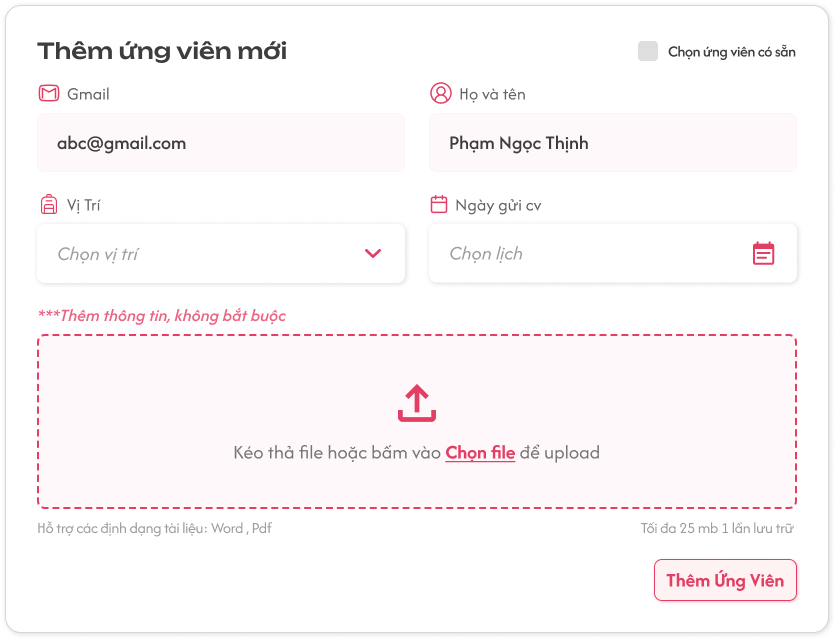
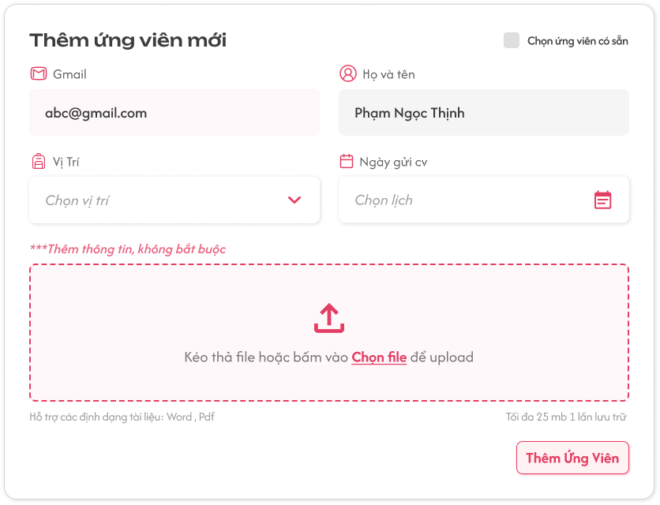
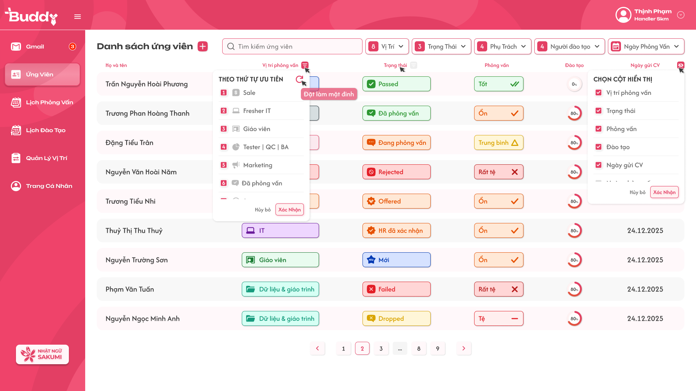
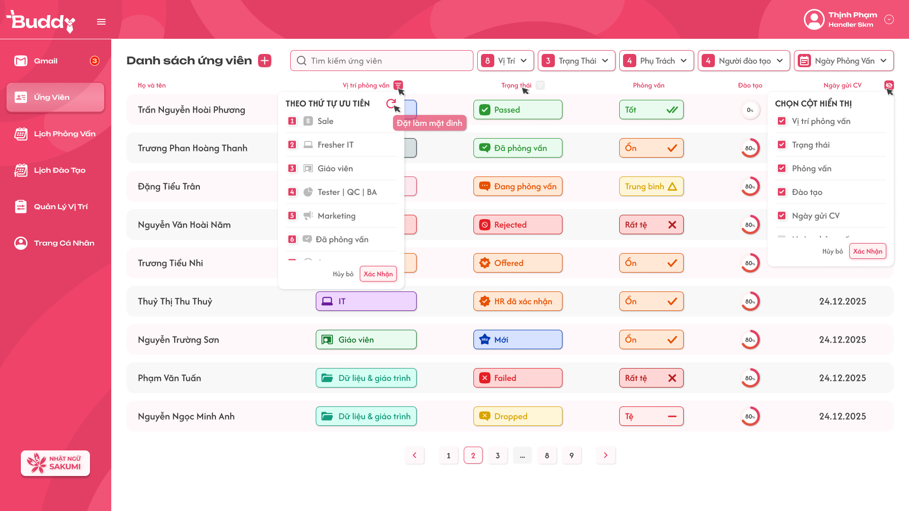

# 👔 Tài liệu đặc tả chức năng Buddy

## I. Giới thiệu hệ thống và tài liệu
### 1. Về hệ thống PLS Buddy +
PLS Buddy+ là hệ thống hỗ trợ quản lý toàn bộ vòng đời tuyển dụng và đào tạo nhân sự trong doanh nghiệp.
Hệ thống cung cấp các chức năng chính bao gồm: quản lý ứng viên, quản lý vị trí tuyển dụng, quản lý phỏng vấn, quản lý đào tạo, và phân quyền theo vai trò.
Mục tiêu của PLS Buddy+ là giúp các bên liên quan (người phụ trách, người phỏng vấn, người đào tạo, ứng viên) dễ dàng tương tác, theo dõi tiến trình, và tối ưu hiệu quả quản lý tuyển dụng – đào tạo.

### 2. Về FSD PLS Buddy +
FSD PLS Buddy+ là tài liệu đặc tả chức năng (Functional Specification Document – FSD) của hệ thống **PLS Buddy+**.
Tài liệu này mô tả chi tiết các **chức năng, luồng xử lý, giao diện liên quan, điều kiện và kết quả hiển thị** của từng chức năng trong hệ thống.
Mục đích của FSD PLS Buddy+ là cung cấp tài liệu chuẩn cho đội ngũ phát triển, kiểm thử và vận hành hệ thống, đảm bảo việc xây dựng, triển khai và sử dụng PLS Buddy+ thống nhất và hiệu quả.

---

## II. Các vai trò trong hệ thống
### Bảng vai trò {#toc-2-1}

  <table class="custom-table">
    <thead>
      <tr>
        <th class="smaller_th">Vai trò</th>
        <th>Mô tả chức năng chính</th>
      </tr>
    </thead>
    <tbody>
        <tr>
            <td class="bold">Người quản lý (Master)</td>
            <td class="light" style="text-align:left">Quyền hạn cao nhất trong hệ thống, Master có quyền thêm / xóa / sửa tài khoản của các vai trò vào hệ thống, thêm / xóa / sửa các vị trí tuyển dụng được hiển thị trên hệ thống</td>
        </tr>
        <tr>
            <td class="bold">Người phụ trách (Handler)</td>
            <td class="light" style="text-align:left">Quản lý toàn bộ quy trình tuyển dụng: thêm và cập nhật ứng viên, gán người phỏng vấn/người đào tạo, theo dõi trạng thái ứng viên, thiết lập vị trí tuyển dụng, tiêu chuẩn, lịch phỏng vấn và quy trình đào tạo.</td>
        </tr>
        <tr>
            <td class="bold">Người phỏng vấn (Interviewer)</td>
            <td class="light" style="text-align:left">Thực hiện phỏng vấn ứng viên được phân công, đánh giá kết quả phỏng vấn theo bộ câu hỏi và tiêu chí đánh giá, xem lịch và lịch sử phỏng vấn các ứng viên được gán.</td>
        </tr>
        <tr>
            <td class="bold">Người đào tạo (Trainer)</td>
            <td class="light" style="text-align:left">Tham gia đào tạo ứng viên/nhân sự sau khi được gán, theo dõi và đánh giá tiến trình đào tạo, sử dụng tài liệu đào tạo, quản lý lịch trình và tiêu chuẩn đào tạo của ứng viên được phân công.</td>
        </tr>
        <tr>
            <td class="bold">Ứng viên / Người được đào tạo (Trainee)</td>
            <td class="light" style="text-align:left">Ứng tuyển vị trí, tham gia phỏng vấn và làm bài kiểm tra. Khi được chuyển sang trạng thái đào tạo, trở thành Người được đào tạo, có thể theo dõi mục tiêu đào tạo, lịch trình, tài liệu và kết quả đánh giá đào tạo.</td>
        </tr>
    </tbody>
  </table>

## III. Đặc tả chức năng chung của các vai trò và mô tả action board {#toc-3}
???+ info "1. Các chức năng chung của các vai trò"
    ### 1. Các chức năng chung của các vai trò {#toc-3-1}
    #### 1.1. Đăng nhập tài khoản {#toc-3-1-1}
    ??? book "Đăng nhập tài khoản"
        | Trường                          | Nội dung |
        | ------------------------------- | -------- |
        | **Tên chức năng**               | Đăng nhập tài khoản |
        | **Vai trò**                     | Người phụ trách, Người đào tạo, Người phỏng vấn, Người được đào tạo |
        | **Mô tả**                       | Chức năng cho phép người dùng có tài khoản hợp lệ đăng nhập vào hệ thống.  - Người dùng nhập thông tin tài khoản và chọn trung tâm muốn làm việc.  - Hệ thống kiểm tra tính hợp lệ của tài khoản (đúng tên đăng nhập/mật khẩu, và tài khoản không bị vô hiệu hóa).  - Nếu tài khoản có nhiều phân quyền, hệ thống mặc định chọn phân quyền **cao nhất** được gán để hiển thị giao diện tương ứng.  - Sau khi đăng nhập thành công, người dùng được điều hướng đến màn hình chính phù hợp với phân quyền. |
        | **Giao diện liên quan**         | - Trang **Đăng nhập**  - Màn hình chính. |
        | **Luồng thao tác chính**        | 1. Người dùng truy cập trang **Đăng nhập**.  2. Nhập tên đăng nhập, mật khẩu và chọn trung tâm.  3. Nhấn nút **Đăng nhập**.  4. Hệ thống kiểm tra thông tin tài khoản:  &emsp;- Nếu hợp lệ → xác định phân quyền cao nhất của tài khoản.  &emsp;- Nếu không hợp lệ → hiển thị thông báo lỗi.  5. Hệ thống điều hướng người dùng đến màn hình chính theo phân quyền tương ứng. |
        | **Điều kiện**                   | - Người dùng có tài khoản trong hệ thống.  - Tài khoản đang không bị vô hiệu hóa.  - Tên đăng nhập và mật khẩu nhập chính xác. |
        | **Kết quả hiển thị**            | - Đăng nhập thành công: hệ thống hiển thị giao diện chính ứng với phân quyền cao nhất.  - Đăng nhập thất bại: hiển thị thông báo lỗi (ví dụ: *“Sai tài khoản hoặc mật khẩu”*). |
        | **Trường hợp không có dữ liệu** | - Nếu tài khoản không tồn tại: hiển thị thông báo *“Tài khoản không tồn tại trong hệ thống”*. |
                📸 **Hình ảnh minh họa**

        > **📁 Thư mục nguồn:** `assets/images/buddy/3-1-1/`

        !!! warning "⚠️ Thư mục không tồn tại"
            Thư mục `assets/images/buddy/3-1-1/` chưa được tạo. Vui lòng tạo thư mục và thêm hình ảnh minh họa.

        *Bấm vào từng ảnh để xem chi tiết.*

    ####  1.2. Cập nhật tài khoản {#toc-3-1-2}
    ??? book "Cập nhật tài khoản"
        | Trường                          | Nội dung |
        | ------------------------------- | -------- |
        | **Tên chức năng**               | Cập nhật tài khoản |
        | **Vai trò**                     | Người phụ trách, Người đào tạo, Người phỏng vấn, Người được đào tạo |
        | **Mô tả**                       | Chức năng cho phép người dùng chỉnh sửa một số thông tin cá nhân của tài khoản sau khi đăng nhập.  - Thông tin hiển thị gồm: **Họ và tên, Giới tính, Ngày sinh, Số điện thoại, Gmail, Vai trò**.  - Người dùng có thể thay đổi: **Họ và tên, Giới tính, Ngày sinh, Số điện thoại**.  - Người dùng không thể thay đổi: **Gmail, Vai trò**.  - Sau khi chỉnh sửa, người dùng nhấn nút **“Cập nhật tài khoản”** để lưu lại thông tin. |
        | **Giao diện liên quan**         | - Menu **Trang Cá Nhân** |
        | **Luồng thao tác chính**        | 1. Người dùng đăng nhập hệ thống.  2. Chọn menu **Trang Cá Nhân**.  3. Hệ thống hiển thị thông tin tài khoản.  4. Người dùng chỉnh sửa thông tin (Họ và tên, Giới tính, Ngày sinh, Số điện thoại).  5. Nhấn nút **Cập nhật tài khoản**.  6. Hệ thống lưu thông tin mới và hiển thị thông báo *“Cập nhật dữ liệu thành công !”*. |
        | **Điều kiện**                   | - Người dùng đã đăng nhập hệ thống.  - Tài khoản tồn tại và đang hoạt động.  - Các trường thông tin nhập vào hợp lệ (ví dụ: Ngày sinh không phải là ngày tương lai, số điện thoại đúng định dạng). |
        | **Kết quả hiển thị**            | - Thông tin cá nhân được cập nhật thành công và hiển thị lại trên giao diện.  - Thông báo *“Cập nhật dữ liệu thành công !”*. |
        | **Trường hợp không có dữ liệu** | - Nếu không có thay đổi gì nhưng vẫn nhấn **Cập nhật tài khoản**, hệ thống vẫn cập nhật lại dữ liệu hiện tại và hiển thị thông báo thành công. |
                📸 **Hình ảnh minh họa**

        > **📁 Thư mục nguồn:** `assets/images/buddy/3-1-2/`

        !!! warning "⚠️ Thư mục không tồn tại"
            Thư mục `assets/images/buddy/3-1-2/` chưa được tạo. Vui lòng tạo thư mục và thêm hình ảnh minh họa.

        *Bấm vào từng ảnh để xem chi tiết.*

    ####  1.3. Đổi mật khẩu {#toc-3-1-3}
    ??? book "Đổi mật khẩu"
        | Trường                          | Nội dung |
        | ------------------------------- | -------- |
        | **Tên chức năng**               | Đổi mật khẩu |
        | **Vai trò**                     | Người phụ trách, Người đào tạo, Người phỏng vấn, Người được đào tạo |
        | **Mô tả**                       | Chức năng cho phép người dùng thay đổi mật khẩu tài khoản thông qua 2 cách:  1. **Tại màn hình đăng nhập**: nhấn nút *“Quên mật khẩu”* → nhập email đã đăng ký → hệ thống xác minh và gửi link đặt lại mật khẩu về email.  2. **Tại menu Trang Cá Nhân**: nhấn nút *“Reset mật khẩu”* → hệ thống tự động lấy email của tài khoản đang đăng nhập và gửi link đặt lại mật khẩu về email. Người dùng cần truy cập link trong email để đặt lại mật khẩu mới. |
        | **Giao diện liên quan**         | - Màn hình **Đăng nhập** (nút *Quên mật khẩu*).  - Menu **Trang Cá Nhân** (nút *Reset mật khẩu*).  - Màn hình đặt lại mật khẩu từ link trong email. |
        | **Luồng thao tác chính**        | **Trường hợp 1 – Quên mật khẩu (ngoài đăng nhập):**  1. Người dùng mở màn hình đăng nhập.  2. Nhấn nút **Quên mật khẩu**.  3. Nhập email đã đăng ký vào hệ thống.  4. Hệ thống xác minh email và gửi link đặt lại mật khẩu.  5. Người dùng truy cập link từ email để đặt lại mật khẩu mới.    **Trường hợp 2 – Reset mật khẩu (trong khi đã đăng nhập):**  1. Người dùng đăng nhập và truy cập **Menu Trang Cá Nhân**.  2. Nhấn nút **Reset mật khẩu**.  3. Hệ thống gửi link đặt lại mật khẩu đến email của tài khoản đang đăng nhập.  4. Người dùng truy cập link từ email để đặt lại mật khẩu mới. |
        | **Điều kiện**                   | - Người dùng có tài khoản đã đăng ký trong hệ thống.  - Email nhập vào (hoặc email đã gán cho tài khoản đăng nhập) tồn tại trong hệ thống.  - Người dùng truy cập hợp lệ vào link reset mật khẩu trong thời hạn cho phép. |
        | **Kết quả hiển thị**            | - Hệ thống gửi email chứa link đặt lại mật khẩu.  - Khi người dùng đặt lại mật khẩu thành công: hiển thị thông báo *“Đặt lại mật khẩu thành công!”*.  - Người dùng có thể dùng mật khẩu mới để đăng nhập. |
        | **Trường hợp không có dữ liệu** | - Email nhập không tồn tại trong hệ thống: hiển thị thông báo *“Email không tồn tại trong hệ thống”*.  - Nếu người dùng chưa đăng nhập và không nhập email: hệ thống yêu cầu nhập email trước khi thực hiện. |
                📸 **Hình ảnh minh họa**

        > **📁 Thư mục nguồn:** `assets/images/buddy/3-1-3/`

        !!! warning "⚠️ Thư mục không tồn tại"
            Thư mục `assets/images/buddy/3-1-3/` chưa được tạo. Vui lòng tạo thư mục và thêm hình ảnh minh họa.

        *Bấm vào từng ảnh để xem chi tiết.*

    ####  1.4. Thay đổi vai trò (đối với tài khoản có nhiều vai trò) {#toc-3-1-4}
    ??? book "Thay đổi vai trò"
        | Trường                          | Nội dung |
        | ------------------------------- | -------- |
        | **Tên chức năng**               | Thay đổi vai trò |
        | **Vai trò**                     | Người phụ trách, Người đào tạo, Người phỏng vấn, Người được đào tạo |
        | **Mô tả**                       | Chức năng cho phép người dùng đã được gán nhiều vai trò trong hệ thống lựa chọn thay đổi vai trò để sử dụng giao diện và chức năng phù hợp. Khi thay đổi, hệ thống sẽ tải lại trang web và hiển thị menu, quyền và chức năng ứng với vai trò vừa chọn. |
        | **Giao diện liên quan**         | - Icon **Account** trên thanh điều hướng (góc trên cùng bên phải).  - Droplist hiển thị danh sách các vai trò đã được gán cho tài khoản. |
        | **Luồng thao tác chính**        | 1. Người dùng đăng nhập vào hệ thống.  2. Nhấn vào icon **Account** (góc trên cùng bên phải).  3. Droplist hiển thị danh sách các vai trò đã gán.  4. Người dùng chọn một vai trò trong danh sách.  5. Hệ thống tải lại trang web và hiển thị giao diện + chức năng theo vai trò đã chọn. |
        | **Điều kiện**                   | - Người dùng đã đăng nhập hợp lệ.  - Tài khoản người dùng được gán từ 2 vai trò trở lên. |
        | **Kết quả hiển thị**            | - Giao diện và chức năng thay đổi theo vai trò vừa chọn.  - Các menu theo vai trò cụ thể:  &emsp;+ **Người phụ trách**: Ứng Viên, Vị Trí, Lịch Phỏng Vấn, Trang Cá Nhân.  &emsp;+ **Người đào tạo**: Lịch Đào Tạo Chung, Danh Sách Đào Tạo, Trang Cá Nhân.  &emsp;+ **Người phỏng vấn**: Lịch Phỏng Vấn, Lịch Sử Phỏng Vấn, Trang Cá Nhân.  &emsp;+ **Người được đào tạo**: Mục Tiêu Đào Tạo, Lịch Trình Đào Tạo, Tài Liệu, Biên Bản Đánh Giá, Trang Cá Nhân. |
        | **Trường hợp không có dữ liệu** | - Nếu tài khoản chỉ có một vai trò, droplist không hiển thị lựa chọn thay đổi vai trò. |
                📸 **Hình ảnh minh họa**

        > **📁 Thư mục nguồn:** `assets/images/buddy/3-1-4/`

        !!! warning "⚠️ Thư mục không tồn tại"
            Thư mục `assets/images/buddy/3-1-4/` chưa được tạo. Vui lòng tạo thư mục và thêm hình ảnh minh họa.

        *Bấm vào từng ảnh để xem chi tiết.*

    ####  1.5. Đăng xuất khỏi tài khoản {#toc-3-1-5}
    ??? book "Đăng xuất khỏi tài khoản"
        | Trường                          | Nội dung |
        | ------------------------------- | -------- |
        | **Tên chức năng**               | Đăng xuất khỏi tài khoản |
        | **Vai trò**                     | Người phụ trách, Người đào tạo, Người phỏng vấn, Người được đào tạo |
        | **Mô tả**                       | Chức năng cho phép người dùng thoát khỏi hệ thống một cách an toàn. Khi đăng xuất, hệ thống kết thúc phiên làm việc hiện tại và đưa người dùng trở về màn hình đăng nhập. |
        | **Giao diện liên quan**         | - Icon **Account** trên thanh điều hướng (góc trên cùng bên phải).  - Droplist hiển thị khi nhấn vào icon **Account**. |
        | **Luồng thao tác chính**        | 1. Người dùng đăng nhập vào hệ thống.  2. Nhấn vào icon **Account** (góc trên cùng bên phải).  3. Droplist hiển thị các tùy chọn, chọn **“Đăng Xuất”**.  4. Hệ thống kết thúc phiên đăng nhập hiện tại.  5. Hệ thống chuyển hướng về màn hình **Đăng nhập**. |
        | **Điều kiện**                   | - Người dùng đã đăng nhập và đang có phiên làm việc hợp lệ. |
        | **Kết quả hiển thị**            | - Phiên đăng nhập của người dùng kết thúc.  - Người dùng được chuyển hướng về màn hình **Đăng nhập**. |
        | **Trường hợp không có dữ liệu** | - Không có trường hợp đặc biệt, vì nút **Đăng Xuất** luôn khả dụng khi người dùng đang đăng nhập. |
                📸 **Hình ảnh minh họa**

        > **📁 Thư mục nguồn:** `assets/images/buddy/3-1-5/`

        !!! warning "⚠️ Thư mục không tồn tại"
            Thư mục `assets/images/buddy/3-1-5/` chưa được tạo. Vui lòng tạo thư mục và thêm hình ảnh minh họa.

        *Bấm vào từng ảnh để xem chi tiết.*
---
## IV. Đặc tả chức năng dành cho Handler (Người Phụ Trách)
???+ info "1. Nhóm chức năng giữa người phụ trách - ứng viên (Buddy_v2)"
    ### 1. Nhóm chức năng giữa người phụ trách - ứng viên {#toc-4-1}
    #### 1.1. Hiển thị bảng danh sách các ứng viên cho người phụ trách {#toc-4-1-1}
    ??? book "Hiển thị bảng danh sách các ứng viên cho người phụ trách"
        | Trường | Nội dung |
        | ------ | -------- |
        | **Tên chức năng** | Hiển thị bảng danh sách các ứng viên cho người phụ trách |
        | **Vai trò** | Người phụ trách |
        | **Mô tả** | Chức năng này cho phép người phụ trách: 1. Xem toàn bộ thông tin về **tất cả ứng viên trong hệ thống** tại bảng **Danh sách ứng viên**. 2. Lọc danh sách ứng viên theo các điều kiện: **Vị trí**, **Trạng thái**, **Người phụ trách**, **Người đào tạo** và **Ngày phỏng vấn**.  Bảng dữ liệu được phân trang, cho phép di chuyển giữa các trang mà không cần tải lại dữ liệu. Người phụ trách chỉ có thể xem, không thể chỉnh sửa thông tin ứng viên tại đây. |
        | **Giao diện liên quan** | 1. Trang **Danh sách ứng viên** (truy cập từ menu "Ứng Viên"). 2. Bảng **Danh sách ứng viên**. 3. Ô tìm kiếm đặt phía trên hoặc bên cạnh bảng dữ liệu. 4. Bộ lọc (filter bar) gồm: **Vị trí**, **Trạng thái**, **Người phụ trách**, **Người đào tạo**, **Ngày phỏng vấn**. |
        | **Luồng thao tác chính** | **Xem danh sách:** 1. Người phụ trách chọn menu **Ứng Viên**. 2. Hệ thống tải dữ liệu của **toàn bộ ứng viên** trong hệ thống. 3. Bảng hiển thị các cột thông tin: Họ và Tên (kèm mã ứng viên khi trỏ chuột), Vị trí phỏng vấn (xem mô tả khi trỏ chuột), Người phụ trách (nhiều người sẽ hiển thị icon có số, trỏ chuột hiện tên), Ngày phỏng vấn, Giờ phỏng vấn, Trạng thái (icon kèm mô tả), Đánh giá (icon kèm mô tả), Ngày gửi CV. 4. Người phụ trách có thể chuyển trang để xem thêm dữ liệu.  **Lọc ứng viên:** 1. Người phụ trách chọn giá trị trong bộ lọc: &emsp;- **Vị trí**: chọn nhiều vị trí từ dropdown. &emsp;- **Trạng thái**: chọn nhiều giá trị từ danh sách trạng thái (`Mới`, `Passed`, `Đã phỏng vấn`, `Đang phỏng vấn`, `HR xác nhận`, `Offered`, `Failed`, `Dropped`, `Rejected`, `Chưa phỏng vấn`). &emsp;- **Người đào tạo**: chọn nhiều người đào tạo (logic AND vì một trainee có thể có nhiều trainer). &emsp;- **Người phụ trách**: chọn nhiều người phụ trách (logic OR trong bộ lọc này vì hiện tại mỗi user chỉ do một người phụ trách chịu trách nhiệm). &emsp;- **Ngày phỏng vấn**: chọn khoảng thời gian bằng popup lịch. 2. Hệ thống tự động áp dụng bộ lọc và hiển thị kết quả theo điều kiện (logic AND giữa các bộ lọc, OR trong từng bộ lọc). 10. Icon bộ lọc hiển thị số lượng giá trị đã chọn, ví dụ `(03) Vị trí`. |
        | **Điều kiện** | 1. Người phụ trách đã đăng nhập với quyền hợp lệ. 2. Hệ thống có ít nhất một ứng viên được ghi nhận. 3. Trang **Danh sách ứng viên** đã tải dữ liệu thành công. |
        | **Kết quả hiển thị** | - Bảng **Danh sách ứng viên** với các cột: Họ và Tên, Vị trí phỏng vấn, Người phụ trách, Ngày phỏng vấn, Giờ phỏng vấn, Trạng thái (icon + mô tả), Đánh giá (icon + mô tả), Ngày gửi CV. - Dữ liệu phân trang, có thể di chuyển giữa các trang. - Kết quả tìm kiếm và lọc hiển thị tức thời, chỉ giữ lại những ứng viên phù hợp. - Người phụ trách có thể kết hợp nhiều bộ lọc cùng lúc để thu hẹp dữ liệu. - Mọi người phụ trách đều nhìn thấy danh sách đầy đủ ứng viên, không bị giới hạn theo quyền sở hữu ứng viên. |
        | **Trường hợp không có dữ liệu** | - Nếu không có ứng viên nào trong hệ thống: Bảng hiển thị thông báo *“Bảng dữ liệu trống!”* kèm icon thùng rỗng. - Nếu không có kết quả tìm kiếm hoặc lọc: Bảng hiển thị thông báo *“Bảng dữ liệu trống!”* kèm icon thùng rỗng. - Nếu ô tìm kiếm trống và không áp dụng bộ lọc: Hiển thị lại toàn bộ danh sách ứng viên ban đầu (nếu có). |
                📸 **Hình ảnh minh họa**

        > **📁 Thư mục nguồn:** `assets/images/buddy/4-1-1/`

        { .image-widget-thumb loading=lazy }
        { .image-widget-thumb loading=lazy }
         copy.png){ .image-widget-thumb loading=lazy }
        .png){ .image-widget-thumb loading=lazy }
         copy.png){ .image-widget-thumb loading=lazy }
        .png){ .image-widget-thumb loading=lazy }

        *Bấm vào từng ảnh để xem chi tiết.*

    #### 1.2. Tùy chọn hiển thị cột trong bảng danh sách ứng viên {#toc-4-1-2}
    ??? book "Tùy chọn hiển thị cột trong bảng danh sách ứng viên"
        | Trường | Nội dung |
        | ------ | -------- |
        | **Tên chức năng** | Tùy chọn hiển thị cột trong bảng danh sách ứng viên |
        | **Vai trò** | Người phụ trách |
        | **Mô tả** | Bảng **Danh sách ứng viên** có tổng cộng 10 cột gồm: Vị trí phỏng vấn, Trạng thái, Phỏng vấn, Đào tạo, Ngày gửi CV, Ngày phỏng vấn, Ngày hết hạn hợp đồng, Ngày sinh, Thời gian training, Thời gian phỏng vấn. Người phụ trách có thể tùy chọn cột nào được hiển thị bằng cách nhấn vào biểu tượng `👁️` ở góc trên bên phải của bảng và chọn các cột mong muốn. Những cột không được chọn sẽ không hiển thị trên màn hình. Cài đặt này được lưu theo từng tài khoản. |
        | **Giao diện liên quan** | 1. Trang **Danh sách ứng viên**. 2. Biểu tượng `👁️` ở góc trên bên phải bảng. 3. Danh sách 10 cột có thể chọn hiển thị. |
        | **Luồng thao tác chính** | 1. Người phụ trách nhấn vào biểu tượng `👁️`. 2. Hệ thống hiển thị danh sách 10 cột. 3. Người phụ trách chọn hoặc bỏ chọn các cột muốn hiển thị. 4. Hệ thống cập nhật bảng theo các cột đã chọn. 5. Hệ thống lưu cấu hình hiển thị theo từng tài khoản. |
        | **Điều kiện** | 1. Người phụ trách đã đăng nhập hợp lệ. 2. Trang **Danh sách ứng viên** đã tải được chọn. |
        | **Kết quả hiển thị** | - Bảng chỉ hiển thị các cột đã được chọn. - Các cột không được chọn sẽ không hiển thị. - Cấu hình được lưu riêng theo từng tài khoản. |
        | **Trường hợp không có dữ liệu** | **Nếu không có ứng viên**: Bảng hiển thị thông báo “Bảng dữ liệu trống!” kèm icon thùng rỗng. |
                📸 **Hình ảnh minh họa**

        > **📁 Thư mục nguồn:** `assets/images/buddy/4-1-2/`

        { .image-widget-thumb loading=lazy }
        .png){ .image-widget-thumb loading=lazy }
        .png){ .image-widget-thumb loading=lazy }

        *Bấm vào từng ảnh để xem chi tiết.*

    #### 1.3. Sắp xếp thứ tự ưu tiên theo từng cột {#toc-4-1-3}
    ??? book "Sắp xếp thứ tự ưu tiên theo từng cột"
        | Trường | Nội dung |
        | ------ | -------- |
        | **Tên chức năng** | Sắp xếp thứ tự ưu tiên theo từng cột |
        | **Vai trò** | Người phụ trách |
        | **Mô tả** | Người phụ trách có thể sắp xếp thứ tự ưu tiên hiển thị theo từng cột bằng cách nhấn vào biểu tượng `☰` bên phải tiêu đề cột. Hệ thống hiển thị dropdown-list “Theo thứ tự ưu tiên” chứa nội dung tương ứng với cột muốn sắp xếp. Người phụ trách có thể kéo thả các item để sắp xếp lại thứ tự hoặc nhấn nút `⟳` để reset về mặc định. |
        | **Giao diện liên quan** | 1. Cột được hiển thị trên bảng (các cột mà người phụ trách đã chọn khi thực hiện thao tác ở chức năng tùy chọn cột muốn xem). 2. Biểu tượng `☰` bên phải tiêu đề cột. 3. Dropdown-list “Theo thứ tự ưu tiên”. 4. Nút `⟳` reset thứ tự mặc định. |
        | **Luồng thao tác chính** | 1. Người phụ trách nhấn vào biểu tượng `☰` tại cột muốn sắp xếp. 2. Hệ thống hiển thị dropdown-list “Theo thứ tự ưu tiên” với nội dung tương ứng cho từng cột. 3. Người phụ trách kéo thả các item để thay đổi thứ tự ưu tiên. 4. Hệ thống áp dụng thứ tự đã sắp xếp. 5. Người phụ trách có thể nhấn `⟳` để reset về thứ tự mặc định. |
        | **Điều kiện** | 1. Cột *Vị trí phỏng vấn* đang được hiển thị. 2. Có ít nhất một vị trí đang có đơn ứng tuyển. |
        | **Kết quả hiển thị** | - Danh sách ứng viên được sắp xếp theo thứ tự ưu tiên đã thiết lập. - Có thể reset về thứ tự mặc định bằng nút `⟳`. |
        | **Trường hợp không có dữ liệu** | **Nếu không có vị trí có đơn ứng tuyển**: Không hiển thị item trong dropdown-list. |
                📸 **Hình ảnh minh họa**

        > **📁 Thư mục nguồn:** `assets/images/buddy/4-1-3/`

        { .image-widget-thumb loading=lazy }
        { .image-widget-thumb loading=lazy }
        { .image-widget-thumb loading=lazy }

        *Bấm vào từng ảnh để xem chi tiết.*

    #### 1.4. Cơ chế sắp xếp theo nhiều cột đã chọn {#toc-4-1-4}
    ??? book "Cơ chế sắp xếp theo nhiều cột đã chọn"
        | Trường | Nội dung |
        | ------ | -------- |
        | **Tên chức năng** | Cơ chế sắp xếp theo nhiều cột đã chọn |
        | **Vai trò** | Người phụ trách |
        | **Mô tả** | Thứ tự của 10 cột tại biểu tượng `👁️` có ý nghĩa trong quá trình sắp xếp. Khi người phụ trách chọn các cột để hiển thị, hệ thống lấy thứ tự mặc định (1 đến 10), sau đó sắp xếp lại theo thứ tự tăng dần để tạo thành thứ tự ưu tiên sắp xếp. *Ví dụ: người dùng chọn cột 2, cột 8, cột 3, cột 6 → hệ thống sắp xếp thành 2 - 3 - 6 - 8 → hoàn tất sort cột 2 → tiếp tục sort cột 3 → 6 → 8. Không giới hạn số lượng cột được chọn. Người phụ trách có thể chọn cả 10 cột và sắp xếp tối đa 9 cột (cột Đào tạo không cần sort)*. |
        | **Giao diện liên quan** | 1. Biểu tượng `👁️`. 2. Các cột được chọn hiển thị trên bảng. 3. Biểu tượng `☰` tại tiêu đề từng cột. |
        | **Luồng thao tác chính** | 1. Người phụ trách chọn các cột muốn hiển thị tại biểu tượng `👁️`. 2. Hệ thống xác định thứ tự mặc định của các cột (1 đến 10). 3. Hệ thống sắp xếp lại theo thứ tự tăng dần để tạo thứ tự ưu tiên. 4. Hệ thống thực hiện sort lần lượt theo từng cột trong thứ tự đã xác định. |
        | **Điều kiện** | 1. Có ít nhất một cột được chọn hiển thị. 2. Các cột được chọn có hỗ trợ sắp xếp (trừ cột Đào tạo). |
        | **Kết quả hiển thị** | - Danh sách ứng viên được sắp xếp theo thứ tự ưu tiên các cột đã chọn. - Có thể chọn tối đa 10 cột và sắp xếp tối đa 9 cột. |
        | **Trường hợp không có dữ liệu** | **Nếu không có dữ liệu ứng viên**: Bảng hiển thị thông báo *“Bảng dữ liệu trống!”* kèm icon thùng rỗng. |
                📸 **Hình ảnh minh họa**

        > **📁 Thư mục nguồn:** `assets/images/buddy/4-1-4/`

        { .image-widget-thumb loading=lazy }
        .png){ .image-widget-thumb loading=lazy }
        .png){ .image-widget-thumb loading=lazy }

        *Bấm vào từng ảnh để xem chi tiết.*

    #### 1.5. Tìm kiếm ứng viên theo ký tự {#toc-4-1-5}
    ??? book "Tìm kiếm ứng viên theo ký tự"
        | Trường | Nội dung |
        | ------ | -------- |
        | **Tên chức năng** | Tìm kiếm ứng viên theo ký tự |
        | **Vai trò** | Người phụ trách |
        | **Mô tả** | Chức năng này cho phép người phụ trách tìm kiếm nhanh ứng viên theo **Họ và Tên** thông qua ô nhập liệu tại trang **Danh sách ứng viên**. Hệ thống tự động lọc danh sách theo chuỗi ký tự được nhập. |
        | **Giao diện liên quan** | 1. Trang **Danh sách ứng viên** (truy cập từ menu "Ứng Viên"). 2. Ô tìm kiếm đặt phía trên hoặc bên cạnh bảng dữ liệu. 3. Bảng **Danh sách ứng viên**. |
        | **Luồng thao tác chính** | 1. Người phụ trách truy cập trang **Danh sách ứng viên**. 2. Người phụ trách nhập ký tự vào ô tìm kiếm. 3. Hệ thống tự động lọc danh sách theo **Họ và Tên** có chứa chuỗi ký tự nhập. 4. Kết quả được cập nhật ngay khi thay đổi ký tự. 5. Khi ô tìm kiếm trống, hệ thống hiển thị lại toàn bộ dữ liệu ban đầu. |
        | **Điều kiện** | 1. Người phụ trách đã đăng nhập với quyền hợp lệ. 2. Trang **Danh sách ứng viên** đã tải dữ liệu thành công. |
        | **Kết quả hiển thị** | - Bảng **Danh sách ứng viên** chỉ hiển thị những ứng viên có **Họ và Tên** chứa chuỗi ký tự đã nhập. - Kết quả cập nhật tức thời khi thay đổi ký tự. - Khi ô tìm kiếm trống, hiển thị lại toàn bộ danh sách ứng viên ban đầu (nếu có). |
        | **Trường hợp không có dữ liệu** | - Nếu không có kết quả phù hợp với chuỗi ký tự nhập: Bảng hiển thị thông báo *“Bảng dữ liệu trống!”* kèm icon thùng rỗng. - Nếu ô tìm kiếm trống: Hiển thị lại toàn bộ danh sách ứng viên ban đầu (nếu có). |
                📸 **Hình ảnh minh họa**

        > **📁 Thư mục nguồn:** `assets/images/buddy/4-1-5/`

        { .image-widget-thumb loading=lazy }
        .png){ .image-widget-thumb loading=lazy }
        .png){ .image-widget-thumb loading=lazy }

        *Bấm vào từng ảnh để xem chi tiết.*

    #### 1.6. Quản lý thông tin chi tiết của ứng viên {#toc-4-1-6}
    ??? book "Quản lý thông tin chi tiết của ứng viên"
        | Trường | Nội dung |
        | ------ | -------- |
        | **Tên chức năng** | Quản lý thông tin chi tiết của ứng viên |
        | **Vai trò** | Người phụ trách |
        | **Mô tả** | Người phụ trách có thể xem các thông tin liên quan về ứng viên khi chọn vào tab "Thông tin" của submenu sau khi chọn một ứng viên trên danh sách ứng viên. Các thông tin được hiển thị bao gồm: &emsp;- Câu trả lời của ứng viên khi ứng tuyển tại miền dành cho ứng viên <a href="https://buddy.pls.edu.vn/ung-vien" target="_blank">(buddy.pls.edu.vn/ung-vien)</a>. &emsp;- Trong trường hợp ứng viên ứng tuyển qua kênh email, các câu trả lời của ứng viên sẽ được HR thêm trực tiếp vào bên dưới các câu hỏi, hệ thống sẽ ghi nhận lịch sử chỉnh sửa gần nhất và hiển thị cho người phụ trách đang xem thông tin. &emsp;- Người phụ trách có quyền thay đổi trạng thái và đánh giá về ứng viên, các thay đổi này sẽ được cập nhật và hiển thị trên bảng danh sách ứng viên. &emsp;- Các thông tin khác như thời gian ứng tuyển, giấy tờ tùy thân, bằng cấp, lịch làm việc mong muốn, thông tin thêm về ứng viên cũng sẽ được hệ thống ghi nhận và hiển thị cho người phụ trách đang xem thông tin chi tiết về ứng viên. |
        | **Giao diện liên quan** | - Submenu "Thông tin" sau khi chọn ứng viên. - Màn hình submenu "Thông tin". |
        | **Luồng thao tác chính** | 1. Người phụ trách chọn một ứng viên từ danh sách ứng viên trong menu "Ứng viên". 2. Sau khi hệ thống hiển thị màn hình "Thông tin" và sidebar chứa các submenu thì người phụ trách có thể xem toàn bộ nội dung cần thiết. 3. Người phụ trách có thể mở rộng các item câu hỏi để xem nội dung bên trong, nội dung có thể là câu trả lời của ứng viên hoặc câu trả lời được HR thêm vào khi tạo profile cho ứng viên. |
        | **Điều kiện** | - Người phụ trách đã đăng nhập và có quyền quản lý ứng viên. - Ứng viên tồn tại trong hệ thống và được nhìn thấy trên bảng danh sách ứng viên. |
        | **Kết quả hiển thị** | - Hiển thị toàn bộ thông tin về ứng viên mà hệ thống ghi nhận được. - Sau khi chỉnh sửa, thông tin được cập nhật và hiển thị thông báo dạng toast với nội dung *"Cập nhật dữ liệu thành công!"*. |
        | **Trường hợp không có dữ liệu** | Item không có thông tin bên trong sẽ hiển thị hint *`Nhập thêm nội dung`*. |
                📸 **Hình ảnh minh họa**

        > **📁 Thư mục nguồn:** `assets/images/buddy/4-1-6/`

        { .image-widget-thumb loading=lazy }
        .png){ .image-widget-thumb loading=lazy }
        .png){ .image-widget-thumb loading=lazy }

        *Bấm vào từng ảnh để xem chi tiết.*

    #### 1.7. Thêm ứng viên mới {#toc-4-1-7}
    ??? book "Thêm ứng viên mới"
        | Trường | Nội dung |
        | ------ | -------- |
        | **Tên chức năng** | Thêm ứng viên mới |
        | **Vai trò** | Người phụ trách |
        | **Mô tả** | Chức năng cho phép người phụ trách tạo và lưu thông tin ứng viên chưa từng ứng tuyển trước đó vào hệ thống.   Khi chọn biểu tượng **(+)** tại màn hình *Danh sách ứng viên*, popup **“Thêm ứng viên mới”** xuất hiện, yêu cầu nhập đầy đủ các thông tin bắt buộc:  &emsp;- Họ và tên  &emsp;- Vị trí  &emsp;- Gmail  &emsp;- Ngày gửi   *Người phụ trách có thể upload file thông tin thêm về ứng viên (bằng cấp, giấy tờ tùy thân, cover letter,...), hệ thống cho phép tổng dung lượng cho một lần upload là 25MB (không tính số lượng file).*  Sau khi nhập thông tin và được hệ thống nhận định là hợp lệ, người phụ trách cần nhấn nút  **“Thêm ứng viên”** để hệ thống tiến hành lưu dữ liệu và hiển thị ứng viên trong bảng. |
        | **Giao diện liên quan** | - Màn hình **Danh sách ứng viên** (menu *Ứng viên*).  - Popup **Thêm ứng viên**. |
        | **Luồng thao tác chính** | 1. Người phụ trách chọn nút **(+)** tại màn hình *Danh sách ứng viên*.  2. Hệ thống hiển thị popup **Thêm ứng viên mới**.  3. Người phụ trách nhập thông tin:  &emsp;- **Họ và tên**.  &emsp;- **Vị trí**: chọn từ danh sách vị trí đang tuyển dụng (dropdown-list).  &emsp;- **Gmail**: đúng định dạng email.  &emsp;- **Ngày gửi CV**: chọn qua popup lịch (không được chọn ngày trong tương lai; khi nhập thủ công theo định dạng *dd/mm/yyyy* cũng không được vượt quá ngày hiện tại).  4. Hệ thống kiểm tra dữ liệu. Nếu hợp lệ, người phụ trách nhấn **“Thêm ứng viên”**.  5. Hệ thống lưu thông tin, cập nhật bảng dữ liệu và hiển thị ứng viên mới. |
        | **Điều kiện** | - Người phụ trách đã đăng nhập với quyền phù hợp. - Email của ứng viên không tồn tại trên hệ thống. - Dữ liệu nhập hợp lệ. - Người phụ trách nhấn nút **“Thêm ứng viên”**. |
        | **Kết quả hiển thị** | Ứng viên mới xuất hiện trong bảng dữ liệu tại màn hình `Danh sách ứng viên`. |
        | **Trường hợp không có dữ liệu** | **Trường hợp không có dữ liệu về các vị trí ứng tuyển đang mở**: Khi mở dropdown-list để chọn vị trí ứng tuyển trên popup **Thêm ứng viên mới**, hệ thống sẽ hiển thị icon thùng rỗng và dòng mô tả **"Không có vị trí khả dụng!"**.  |
                📸 **Hình ảnh minh họa**

        > **📁 Thư mục nguồn:** `assets/images/buddy/4-1-7/`

        { .image-widget-thumb loading=lazy }
        { .image-widget-thumb loading=lazy }
         copy.png){ .image-widget-thumb loading=lazy }
        .png){ .image-widget-thumb loading=lazy }
         copy.png){ .image-widget-thumb loading=lazy }
        .png){ .image-widget-thumb loading=lazy }

        *Bấm vào từng ảnh để xem chi tiết.*

    #### 1.8. Tạo đơn ứng tuyển cho ứng viên đã từng apply {#toc-4-1-8}
    ??? book "Tạo đơn ứng tuyển cho ứng viên đã từng apply"
        | Trường | Nội dung |
        | ------ | -------- |
        | **Tên chức năng** | Tạo đơn ứng tuyển cho ứng viên đã từng apply |
        | **Vai trò** | Người phụ trách |
        | **Mô tả** | Chức năng cho phép hệ thống xử lý 2 trường hợp sau: **1. Ứng viên đã từng ứng tuyển trước đó và có nguyện vọng ứng tuyển lại.** **2. Ứng viên ứng tuyển vào nhiều vị trí cùng một lúc.**  Trong cả 2 trường hợp, hệ thống sẽ tự động kiểm tra email và tự động điền đầy đủ họ và tên của ứng viên đã từng ứng tuyển vào popup **Thêm ứng viên mới**. Khi người phụ trách nhấn nút **Thêm ứng viên**, hệ thống sẽ kiểm tra đơn ứng tuyển gần nhất của ứng viên đã hoàn thành chưa (Đã được phỏng vấn và có đánh giá thì tính là hoàn thành), nếu chưa hoàn thành thì cần phải được đánh giá hoặc xóa thì mới có thể tạo mới đơn ứng tuyển tiếp theo.  |
        | **Giao diện liên quan** | - Màn hình **Danh sách ứng viên** (menu *Ứng viên*).  - Popup **Thêm ứng viên**. |
        | **Luồng thao tác chính** | 1. Người phụ trách chọn nút **(+)** tại màn hình *Danh sách ứng viên*.  2. Hệ thống hiển thị popup **Thêm ứng viên mới**.  3. Người phụ trách nhập thông tin:  &emsp;- **Họ và tên**.  &emsp;- **Vị trí**: chọn từ danh sách vị trí đang tuyển dụng (dropdown-list).  &emsp;- **Gmail**: đúng định dạng email.  &emsp;- **Ngày gửi CV**: chọn qua popup lịch (không được chọn ngày trong tương lai; khi nhập thủ công theo định dạng *dd/mm/yyyy* cũng không được vượt quá ngày hiện tại).  4. Hệ thống kiểm tra dữ liệu. Nếu hợp lệ, người phụ trách nhấn **“Thêm ứng viên”**.  5. Hệ thống kiểm tra thông tin về ứng viên và hiển thị popup chứa nội dung *Email này đã được đăng ký trước đó. Hệ thống sẽ tạo hồ sơ ứng tuyển mới cho vị trí này trên tài khoản hiện có. Bạn có muốn tiếp tục không?*. 6. Người phụ trách nhấn nút **"Xác nhận"** để tiếp tục thao tác. 7. Hệ thống thực hiện lưu đơn ứng tuyển mới cho ứng viên đó và hiển thị lên danh sách ứng viên. |
        | **Điều kiện** | - Người phụ trách đã đăng nhập với quyền phù hợp. - Email của ứng viên đã tồn tại trên hệ thống. - Dữ liệu nhập hợp lệ. - Người phụ trách nhấn nút **“Thêm ứng viên”**. - Người phụ trách nhấn nút **"Xác nhận"**. |
        | **Kết quả hiển thị** | Ứng viên xuất hiện trong bảng dữ liệu tại màn hình `Danh sách ứng viên`. |
        | **Trường hợp không có dữ liệu** | **Trường hợp không có dữ liệu về các vị trí ứng tuyển đang mở**: Khi mở dropdown-list để chọn vị trí ứng tuyển trên popup **Thêm ứng viên mới**, hệ thống sẽ hiển thị icon thùng rỗng và dòng mô tả **"Không có vị trí khả dụng!"**.  **Trường hợp ứng viên có đơn ứng tuyển chưa được hoàn thành**: hệ thống sẽ hiển thị popup thông báo cho người dùng rằng ứng viên này đang có đơn ứng tuyển chưa hoàn thành và cung cấp đường dẫn đến đơn ứng tuyển đó, người phụ trách cần thực hiện đánh giá đơn ứng tuyển đó hoặc xóa đơn ứng tuyển để hệ thống có thể tiếp nhận đơn ứng tuyển mới của ứng viên. |
                📸 **Hình ảnh minh họa**

        > **📁 Thư mục nguồn:** `assets/images/buddy/4-1-8/`

        { .image-widget-thumb loading=lazy }
        .png){ .image-widget-thumb loading=lazy }
        .png){ .image-widget-thumb loading=lazy }

        *Bấm vào từng ảnh để xem chi tiết.*

    #### 1.9. Chức năng chuyển đổi giữa nhập liệu bằng tay và chọn ứng viên từ CSDL khi thêm ứng viên {#toc-4-1-9}
    ??? book "Chức năng chuyển đổi giữa nhập liệu bằng tay và chọn ứng viên từ CSDL khi thêm ứng viên"
        | Trường | Nội dung |
        | ------ | -------- |
        | **Tên chức năng** | Chức năng chuyển đổi giữa nhập liệu bằng tay và chọn ứng viên từ CSDL khi thêm ứng viên |
        | **Vai trò** | Người phụ trách |
        | **Mô tả** | Chức năng này cho phép người phụ trách chọn ứng viên dựa trên email mà ứng viên cung cấp từ CSDL của hệ thống, khi người phụ trách lựa chọn một ứng viên từ dropdown-list, hệ thống sẽ tự động điền dữ liệu về họ và tên và ngày tháng năm sinh (định dạng *dd/mm/yyyy*) vào các trường thông tin trên popup **Thêm ứng viên mới**. Sau khi đã chọn xong thì thực hiện chức năng **1.5. Tạo đơn ứng tuyển cho ứng viên đã từng apply**.  |
        | **Giao diện liên quan** | - Màn hình **Danh sách ứng viên** (menu *Ứng viên*).  - Popup **Thêm ứng viên**: &emsp;Tickbox *Chọn ứng viên có sẵn* &emsp;Dropdown-list *Chọn Gmail*  |
        | **Luồng thao tác chính** | 1. Người phụ trách chọn nút **(+)** tại màn hình *Danh sách ứng viên*.  2. Hệ thống hiển thị popup **Thêm ứng viên mới**. 3. Người phụ trách tick vào tickbox *Chọn ứng viên có sẵn*. 4. Hệ thống thay đổi ô *Nhập Email* thành dropdown-list để chọn địa chỉ email từ CSDL, người phụ trách có thể tìm kiếm địa chỉ email. 5. Sau khi chọn email, hệ thống tự động điền các thông tin tại ô *Họ và tên* và *Ngày tháng năm sinh* (nếu có). 6. Tương tự chức năng **1.5. Tạo đơn ứng tuyển cho ứng viên đã từng apply**. |
        | **Điều kiện** | - Người phụ trách đã đăng nhập với quyền phù hợp. - Người phụ trách tick vào tickbox *Chọn ứng viên có sẵn*. - Email của ứng viên đã tồn tại trên hệ thống. |
        | **Kết quả hiển thị** | - Nội dung popup thay đổi về mặt giao diện. - Ứng viên xuất hiện trong bảng dữ liệu tại màn hình `Danh sách ứng viên` sau khi xác nhận thêm. |
        | **Trường hợp không có dữ liệu** | **Trường hợp không có dữ liệu về các vị trí ứng tuyển đang mở**: Khi mở dropdown-list để chọn vị trí ứng tuyển trên popup **Thêm ứng viên mới**, hệ thống sẽ hiển thị icon thùng rỗng và dòng mô tả **"Không có vị trí khả dụng!"**.  **Trường hợp không có ứng viên nào trong CSDL**: Khi mở dropdown-list để chọn ứng viên trên popup **Thêm ứng viên mới**, hệ thống sẽ hiển thị icon thùng rỗng và dòng mô tả **"Không có ứng viên nào!"** |
                📸 **Hình ảnh minh họa**

        > **📁 Thư mục nguồn:** `assets/images/buddy/4-1-9/`

        { .image-widget-thumb loading=lazy }
        .png){ .image-widget-thumb loading=lazy }
        .png){ .image-widget-thumb loading=lazy }

        *Bấm vào từng ảnh để xem chi tiết.*

    #### 1.10. Tự động gán người phụ trách ứng viên {#toc-4-1-10}
    ??? book "Tự động gán người phụ trách ứng viên"
        | Trường | Nội dung |
        | ------ | -------- |
        | **Tên chức năng** | Tự động gán người phụ trách ứng viên |
        | **Vai trò** | Người phụ trách |
        | **Mô tả** | Chức năng này cho phép hệ thống tự động gán người phụ trách khi thêm ứng viên vào hệ thống. *( hệ thống lấy thông tin người phụ trách đang thực hiện việc tạo profile và gán cho ứng viên đó )* |
        | **Giao diện liên quan** | - Màn hình **Danh sách ứng viên** (menu *Ứng viên*).  - Popup **Thêm ứng viên**. |
        | **Luồng thao tác chính** | - Khi người phụ trách tạo một profile mới dành cho một ứng viên, hệ thống tự động lấy thông tin của người phụ trách đó để gán. - Hệ thống xác nhận việc ghi nhận thông tin người phụ trách khi người phụ trách nhấn nút **Thêm ứng viên** trên popup. |
        | **Điều kiện** | Tài khoản đang đăng nhập đã được gán phân quyền người phụ trách. |
        | **Kết quả hiển thị** | Sau khi hệ thống thông báo thêm thành công và người dùng sử dụng filter *Phụ trách* trên danh sách ứng viên, hệ thống thực hiện truy vấn các profiles ứng viên được tạo bởi các người phụ trách được chọn. |
        | **Trường hợp không có dữ liệu** | **Trường hợp người phụ trách được chọn chưa tạo bất kỳ profile ứng viên nào :** &emsp;- Hệ thống hiển thị mô tả *“Bảng dữ liệu trống!”* kèm icon thùng rỗng. |
                📸 **Hình ảnh minh họa**

        > **📁 Thư mục nguồn:** `assets/images/buddy/4-1-10/`

        { .image-widget-thumb loading=lazy }
        .png){ .image-widget-thumb loading=lazy }
        .png){ .image-widget-thumb loading=lazy }

        *Bấm vào từng ảnh để xem chi tiết.*
---
???+ info "2. Nhóm chức năng quản lý vị trí tuyển dụng"
    ### 2. Nhóm chức năng quản lý vị trí tuyển dụng {#toc-4-2}
    #### 2.1. Xem danh sách vị trí tuyển dụng {#toc-4-2-1}
    ??? book "Xem danh sách vị trí tuyển dụng"
        | Trường | Nội dung |
        | ------ | -------- |
        | **Tên chức năng** | Xem danh sách vị trí tuyển dụng |
        | **Vai trò** | Người phụ trách |
        | **Mô tả** | Chức năng cho phép người phụ trách xem danh sách toàn bộ các vị trí đã và đang tuyển dụng. Thông tin được hiển thị tại bảng **“Danh sách vị trí ứng tuyển”** với các cột dữ liệu mô tả tình trạng và tiến độ tuyển dụng. Người phụ trách có thể theo dõi số lượng ứng viên, tình trạng phỏng vấn, quá trình đào tạo và trạng thái hiện tại của từng vị trí. |
        | **Giao diện liên quan** | - Menu **“Quản lý vị trí”**. - Màn hình **“Danh sách vị trí ứng tuyển”** hiển thị danh sách tất cả các vị trí. |
        | **Luồng thao tác chính** | 1. Người phụ trách đăng nhập vào hệ thống. 2. Chọn menu **“Quản lý vị trí”**. 3. Hệ thống hiển thị bảng **“Danh sách vị trí ứng tuyển”**. 4. Người phụ trách theo dõi thông tin từng vị trí qua các cột: &emsp;a. **Tên và vai trò**: tên vị trí tuyển dụng. &emsp;b. **Ứng viên**: số lượng ứng viên đã ứng tuyển. &emsp;c. **Chờ phỏng vấn**: số lượng ứng viên đã được lên lịch phỏng vấn. &emsp;d. **Đang đào tạo**: số lượng ứng viên đã pass phỏng vấn và đang tham gia đào tạo. &emsp;e. **Trạng thái**: tình trạng của vị trí *(Đang hoạt động / Dừng hoạt động)*, cho phép người phụ trách thay đổi bằng cách nhấn nút toggle_on-off. 5. Người dùng có thể xóa vị trí bằng cách hover vào từng item và nhấn biểu tượng *(x)* ở góc trên bên phải của từng item.  |
        | **Điều kiện** | - Người phụ trách đã đăng nhập và có quyền xem thông tin vị trí. - Hệ thống đã có dữ liệu về các vị trí tuyển dụng. |
        | **Kết quả hiển thị** | - Bảng **“Danh sách vị trí ứng tuyển”** hiển thị đầy đủ các vị trí cùng các cột thông tin liên quan. - Dữ liệu được cập nhật theo thời gian thực hoặc theo batch (tùy cấu hình hệ thống). - Trạng thái được thể hiện trực quan bằng nút toggle_on-off. |
        | **Trường hợp không có dữ liệu** | - Nếu chưa có vị trí nào, bảng dữ liệu thông báo *Bảng này hiện đang trống!* kèm với icon thùng rỗng. - Nếu dữ liệu tại các cột đếm (Ứng viên, Chờ phỏng vấn, Đang đào tạo) bằng 0: hiển thị giá trị `0` thay vì để trống. |
                📸 **Hình ảnh minh họa**

        > **📁 Thư mục nguồn:** `assets/images/buddy/4-2-1/`

        !!! warning "⚠️ Chưa có hình ảnh minh họa"
            Thư mục `assets/images/buddy/4-2-1/` hiện đang trống. Vui lòng thêm các hình ảnh minh họa cho tính năng này.

        *Bấm vào từng ảnh để xem chi tiết.*

    #### 2.2. Tạo vị trí tuyển dụng mới {#toc-4-2-2}
    ??? book "Tạo vị trí tuyển dụng mới"
        | Trường | Nội dung |
        | ------ | -------- |
        | **Tên chức năng** | Tạo vị trí tuyển dụng mới |
        | **Vai trò** | Người phụ trách |
        | **Mô tả** | Chức năng này cho phép người phụ trách tạo ra các vị trí tuyển dụng mới chưa có trên hệ thống. Các vị trí mới được thiết lập bao gồm các nội dung: - Tên vị trí - Màu đại diện - Biểu tượng của vị trí |
        | **Giao diện liên quan** | - Menu **“Quản lý vị trí”**. - Màn hình **“Danh sách vị trí ứng tuyển”** hiển thị danh sách tất cả các vị trí. - Popup **Thêm vị trí ứng tuyển**. |
        | **Luồng thao tác chính** | 1. Người phụ trách chọn vào biểu tượng **(+)** ở bên cạnh dòng chữ **"Danh sách vị trí ứng tuyển"** ở màn hình của menu **"Quản lý vị trí"**. 2. Hệ thống hiển thị popup **"Thêm vị trí ứng tuyển"** bao gồm các thông tin sau: &emsp;- Trường nhập liệu *Nhập vị trí* &emsp;- Dropdown-list **Icon** để mở pool icon được thiết lập sẵn &emsp;- Pool màu sắc được tùy chỉnh trước (để đảm bảo tính tương phản, người dùng có thể request một màu mới) 3. Thao tác tạo mới một vị trí tuyển dụng tuân thủ các bước sau: &emsp;- Điền đầy đủ các trường thông tin *Nhập vị trí*, chọn icon mong muốn (từ pool icon có sẵn hoặc tải về file mới bằng cách nhấn nút <a href="https://iconify.design" target="_blank">*Thêm ...*</a>) &emsp;- Chọn một bộ màu từ pool màu sắc trên popup, bộ màu được chọn sẽ được highlight bằng border, các màu còn lại sẽ bị giảm oppacity đi 50% &emsp;- *Chọn trạng thái* mong muốn cho vị trí sắp tạo bằng cách tùy chỉnh nút toggle_on-off ở góc trên bên phải của popup này, mặc định khi tạo sẽ là **toggle_on** &emsp;- Nhấn nút **Thêm mới** &emsp;- Hệ thống kiểm tra tên của vị trí mới và đảm bảo không tồn tại vị trí nào có trùng tên &emsp;- Tiến hành việc thêm vị trí mới khi đã có đủ tên vị trí và màu sắc tương ứng. |
        | **Điều kiện** | Người phụ trách đã đăng nhập và có quyền xem thông tin vị trí. |
        | **Kết quả hiển thị** | - Hệ thống hiển thị thông báo dạng toast với nội dung *"Vị trí mới được thêm thành công!"* - Vị trí mới tạo được thêm vào ngay dòng đầu tiên của **"Danh sách vị trí ứng tuyển"**. |
        | **Trường hợp không có dữ liệu** | **Không có** |
                📸 **Hình ảnh minh họa**

        > **📁 Thư mục nguồn:** `assets/images/buddy/4-2-2/`

        !!! warning "⚠️ Chưa có hình ảnh minh họa"
            Thư mục `assets/images/buddy/4-2-2/` hiện đang trống. Vui lòng thêm các hình ảnh minh họa cho tính năng này.

        *Bấm vào từng ảnh để xem chi tiết.*

    #### 2.3. Xem thông tin tổng quan về vị trí tuyển dụng {#toc-4-2-3}
    ??? book "Xem thông tin tổng quan về vị trí tuyển dụng"
        | Trường | Nội dung |
        | ------ | -------- |
        | **Tên chức năng** | Xem thông tin tổng quan về vị trí tuyển dụng |
        | **Vai trò** | Người phụ trách |
        | **Mô tả** | Chức năng cho phép người phụ trách xem được các thống kê về vị trí tuyển dụng đã chọn tại **"Danh sách vị trí ứng tuyển"** |
        | **Giao diện liên quan** | 1. Menu **“Quản lý vị trí”**. 2. Màn hình **“Danh sách vị trí ứng tuyển”** hiển thị danh sách tất cả các vị trí. 3. Sub-menu dành riêng cho từng vị trí được chọn từ **“Danh sách vị trí ứng tuyển”**, bao gồm các submenu sau: &emsp;- Tổng quan &emsp;- Mô tả (JD) &emsp;- K.Tra đầu vào &emsp;- Phỏng vấn &emsp;- Đào tạo &emsp;- Sau đào tạo.  4. Màn hình **Tổng quan vị trí** của submenu Tổng quan. |
        | **Luồng thao tác chính** | 1. Người phụ trách chọn một vị trí muốn thao tác trên bảng **“Danh sách vị trí ứng tuyển”** của ở menu **"Quản lý vị trí"**. 2. Hệ thống hiển thị thêm một sidebar mới, sidebar này sẽ chứa nội dung của sub-menu. 3. Người phụ trách cần chọn vào submenu *Tổng quan*. 4. Hệ thống hiển thị màn hình *Tổng quan vị trí*, trên màn hình này bao gồm các nội dung sau: &emsp;+ Thông tin vị trí: bao gồm tên vị trí, icon của vị trí (người phụ trách có thể thay đổi tên và icon của vị trí bằng cách nhấn vào nút `✏️`. ) &emsp;+ Người phụ trách được phép thay đổi trạng thái của vị trí này bằng cách nhấn nút toggle_on-off ở bên phải màn hình &emsp;+ Các biểu đồ `Số lượng CV`, `Số lượng phỏng vấn`, `Pass phỏng vấn`, `Training`, `Thử việc` sẽ mặc định hiển thị toàn bộ dữ liệu về vị trí tính từ lúc tạo vị trí, người dùng có thể tùy chọn thay đổi thời gian xem biểu đồ bằng cách tùy chỉnh thời gian ở nút `📅` ở góc trên cùng bên phải của màn hình này. &emsp;+ Người phụ trách có thể thực hiện thao tác xóa bằng cách chọn vào nút `Xóa vị trí` và xác nhận thao tác trên popup cảnh báo. |
        | **Điều kiện** | Người phụ trách đã đăng nhập và có quyền xem thông tin vị trí. |
        | **Kết quả hiển thị** | **Trường hợp xem thông tin của vị trí**: Hiển thị giao diện đầy đủ thông tin về vị trí, các nút đúng với mô tả. **Trường hợp xóa vị trí**: Hệ thống điều hướng người phụ trách về màn hình chứa **"Danh sách vị trí ứng tuyển"** và thông báo dạng toast "Vị trí {`Tên vị trí`} đã được xóa!". |
        | **Trường hợp không có dữ liệu** | **Trường hợp vị trí chưa từng ghi nhận bất kỳ dữ liệu nào**: Hệ thống hiển thị thông tin tổng quan mô tả vị trí, các biểu đồ vẫn được hiển thị nhưng sẽ hiển thị dữ liệu = 0, biểu đồ đường sẽ nằm trùng với trục X (thể hiện không có dữ liệu gì). |
                📸 **Hình ảnh minh họa**

        > **📁 Thư mục nguồn:** `assets/images/buddy/4-2-3/`

        !!! warning "⚠️ Chưa có hình ảnh minh họa"
            Thư mục `assets/images/buddy/4-2-3/` hiện đang trống. Vui lòng thêm các hình ảnh minh họa cho tính năng này.

        *Bấm vào từng ảnh để xem chi tiết.*

    #### 2.3. Thiết lập mô tả vị trí tuyển dụng (JD) {#toc-4-2-3}
    ??? book "Thiết lập mô tả vị trí tuyển dụng (JD)"
        | Trường | Nội dung |
        | ------ | -------- |
        | **Tên chức năng** | Thiết lập mô tả vị trí tuyển dụng (JD) |
        | **Vai trò** | Người phụ trách |
        | **Mô tả** | Chức năng này cho phép người phụ trách tạo các profile cho mô tả công việc, mỗi profile sẽ là một biến thể của mô tả công việc dành cho vị trí đang được chọn. Người phụ trách có toàn quyền tùy chỉnh JD cho vị trí tuyển dụng đang có trong hệ thống. Các profile này sẽ được lưu và hiển thị ở phần **Danh sách mô tả** khi người phụ trách truy cập vào submenu *Mô Tả (JD)*. |
        | **Giao diện liên quan** | 1. Menu **“Quản lý vị trí”**. 2. Màn hình **“Danh sách vị trí ứng tuyển”** hiển thị danh sách tất cả các vị trí. 3. Sub-menu dành riêng cho từng vị trí được chọn từ **“Danh sách vị trí ứng tuyển”**, bao gồm các submenu sau: &emsp;- Tổng quan &emsp;- Mô tả (JD) &emsp;- K.Tra đầu vào &emsp;- Phỏng vấn &emsp;- Đào tạo &emsp;- Sau đào tạo.  4. Màn hình chứa *Danh sách mô tả* ở submenu *Mô Tả (JD)*. |
        | **Luồng thao tác chính** | 1. Người phụ trách chọn một vị trí tuyển dụng từ **"Danh sách vị trí ứng tuyển"**. 2. Hệ thống điều hướng sang màn hình chứa submenu và mặc định trỏ vào submenu *Tổng Quan*. 3. Người phụ trách chuyển sang submenu *Mô Tả (JD)*. 4. Để thiết lập một profile mô tả (JD) mới, người phụ trách cần đặt tên cho profile và phải nhấn [ENTER] để lưu. 5. Sau khi hệ thống đã lưu profile mới, hệ thống sẽ hiển thị tên của profile JD này lên giữa màn hình với tên của profile được in đậm ở phía trên cùng của màn hình, bên dưới tên của profile này sẽ bao gồm 2 phần: &emsp;- *Nhập mô tả*: Người phụ trách nhập mô tả vào phần này, khi nhập xong và nhấn [ENTER] thì hệ thống sẽ thực hiện việc lưu dữ liệu và thông báo dạng toast cho người dùng với nội dung *"Đã lưu thay đổi cho +  {tên của profile đang thiết lập}"*   &emsp;- *Nhập danh mục mới*: hệ thống quy định các danh mục để người phụ trách dễ dàng quản lý nội dung của JD, khi tạo danh mục mới, người phụ trách phải nhập tên của danh mục vào và nhấn [ENTER] để hệ thống thực hiện lưu. Sau khi lưu, hệ thống cập nhật lại danh mục đó để hiển thị ngay trên màn hình của người phụ trách (không reload). 6. Các thao tác với danh mục chứa nội dung của JD: &emsp;- Thêm mô tả danh mục và các nội dung chi tiết bên trong &emsp;- Xóa danh mục và xóa nội dung chi tiết bên trong (Khi xóa thì phải xác nhận thông qua popup cảnh báo) &emsp;- Sắp xếp lại thứ tự của danh mục và sắp xếp nội dung của từng danh mục 7. Người phụ trách có thể bật nhiều mô tả công việc cùng lúc để tùy biến cách sử dụng (ví dụ: có thể tạo vị trí Data và tạo nhiều JD cho 6 trung tâm: Anh, Pháp, Đức, Trung, Nhật, Hàn).|
        | **Điều kiện** | Người phụ trách đã đăng nhập và truy cập vào thông tin vị trí. |
        | **Kết quả hiển thị** | - Khi hoàn tất việc thiết lập một JD tiêu chuẩn, người phụ trách sẽ xem được nội dung của JD bao gồm: tên. mô tả, danh mục, mô tả của danh mục, các tiêu chí con trong từng danh mục. - Trường hợp có nhiều JD, người phụ trách sẽ xem được nội dung tương ứng khi chọn vào JD đó.  |
        | **Trường hợp không có dữ liệu** | **Trường hợp đã tạo JD nhưng không xem được**: Cần có thông báo lỗi khi tải dữ liệu để người dùng report đến IT. **Trường hợp vị trí tuyển dụng chưa có profile JD nào được thiết lập**: Hệ thống hiển thị màn hình trống với biểu tượng "Không có dữ liệu!"|
                📸 **Hình ảnh minh họa**

        > **📁 Thư mục nguồn:** `assets/images/buddy/4-2-3/`

        !!! warning "⚠️ Chưa có hình ảnh minh họa"
            Thư mục `assets/images/buddy/4-2-3/` hiện đang trống. Vui lòng thêm các hình ảnh minh họa cho tính năng này.

        *Bấm vào từng ảnh để xem chi tiết.*

    #### 2.4. Thiết lập tiêu chuẩn ứng viên {#toc-4-2-4}
    ??? book "Thiết lập tiêu chuẩn ứng viên"
        | Trường | Nội dung |
        | ------ | -------- |
        | **Tên chức năng** | Thiết lập tiêu chuẩn ứng viên |
        | **Vai trò** | Người phụ trách |
        | **Mô tả** | Chức năng giúp người phụ trách thiết lập các tiêu chuẩn để người phỏng vấn có thể đánh giá ứng viên trong quá trình phỏng vấn. Các tiêu chuẩn phỏng vấn mà người phụ trách được phép thiết lập ở chức năng / màn hình này là [`action_type : check (action kiểm tra)`]. |
        | **Giao diện liên quan** | - Menu **“Quản Lý Vị trí”**. - Submenu: **“Phỏng vấn”**, bao gồm các tab: **Tiêu chuẩn ứng viên**, **Các câu hỏi thông tin**, **Các vòng phỏng vấn**, **Thiết lập K.tra đầu vào**. - Tab **“Tiêu chuẩn ứng viên”**. |
        | **Luồng thao tác chính** |  |
        | **Điều kiện** | - Người phụ trách đã đăng nhập và có quyền quản lý vị trí. - Vị trí tuyển dụng đã tồn tại trong hệ thống. - Khi thêm mới thẻ: tên tiêu chuẩn không được để trống. - Khi thêm/sửa mục: nội dung mục đánh giá phải hợp lệ (không trống). |
        | **Kết quả hiển thị** | - Danh sách thẻ tiêu chuẩn được hiển thị và có thể thao tác mở rộng/thu gọn. - Sau khi thêm/sửa/xóa, dữ liệu được cập nhật ngay trên màn hình. - Thông báo thành công hiển thị khi thao tác hợp lệ. |
        | **Trường hợp không có dữ liệu** | - Nếu chưa có thẻ tiêu chuẩn nào: hiển thị ô **“Nhập Danh Mục Mới”** để thêm. - Nếu thẻ chưa có mục đánh giá: hiển thị thẻ rỗng với nút **“Thêm mục đánh giá”**. - Khi xóa hết thẻ: màn hình trở về trạng thái trống kèm hướng dẫn thêm mới. |
                📸 **Hình ảnh minh họa**

        > **📁 Thư mục nguồn:** `assets/images/buddy/4-2-4/`

        !!! warning "⚠️ Chưa có hình ảnh minh họa"
            Thư mục `assets/images/buddy/4-2-4/` hiện đang trống. Vui lòng thêm các hình ảnh minh họa cho tính năng này.

        *Bấm vào từng ảnh để xem chi tiết.*
---
???+ info "3. Nhóm chức năng quản lý phỏng vấn"
    ### 3. Nhóm chức năng quản lý phỏng vấn {#toc-4-3}
    #### 3.1. Thiết lập quy trình phỏng vấn {#toc-4-3-1}
    ??? book "Thiết lập các vòng phỏng vấn"
        | Trường | Nội dung |
        | ------ | -------- |
        | **Tên chức năng** | Thiết lập các vòng phỏng vấn |
        | **Vai trò** | Người phụ trách |
        | **Mô tả** | Chức năng cho phép người phụ trách quản lý các vòng phỏng vấn của một vị trí tuyển dụng.   - Các vòng phỏng vấn được hiển thị trong **danh sách bên phải màn hình**, mỗi vòng thể hiện dưới dạng **thẻ** kèm trạng thái (Kích hoạt / Vô hiệu / Xóa).  - Khi mở rộng một thẻ, hệ thống hiển thị **danh sách mục con** (tiêu chí đánh giá).  - Khi chọn một mục con, phần màn hình bên trái hiển thị chi tiết các **tiêu chí đánh giá** của mục đó.  - Người phụ trách có thể **thêm, sửa, xóa** các tiêu chí.  - Khi mở rộng tiêu chí, hiển thị chi tiết **các yêu cầu** gắn với tiêu chí đó và trạng thái thể hiện **mức độ cần thiết** của yêu cầu đối với vị trí ứng tuyển. |
        | **Giao diện liên quan** | - Menu chính: **“Vị trí”**. - Menu phụ: **“Phỏng vấn”**. - Sub-menu: **“Các Vòng Phỏng Vấn”**. - Màn hình: **“Các Vòng Phỏng Vấn”** gồm: &emsp;+ Cột bên phải: Danh sách thẻ vòng phỏng vấn. &emsp;+ Khu vực bên trái: Hiển thị tiêu chí và yêu cầu chi tiết của mục con. |
        | **Luồng thao tác chính** | 1. Người phụ trách đăng nhập và vào **Menu “Vị trí” → Menu phụ “Phỏng vấn” → Sub-menu “Các Vòng Phỏng Vấn”**. 2. Hệ thống hiển thị màn hình với danh sách vòng phỏng vấn (cột bên phải). 3. Người phụ trách có thể: &emsp;- Mở rộng/thu gọn thẻ vòng phỏng vấn để xem mục con. &emsp;- Chọn mục con để hiển thị các tiêu chí tương ứng ở khu vực bên trái. &emsp;- Thêm mới, chỉnh sửa, xóa tiêu chí. &emsp;- Mở rộng tiêu chí để xem/cập nhật các yêu cầu chi tiết kèm trạng thái mức độ cần thiết. 4. Sau khi thao tác, hệ thống cập nhật dữ liệu và hiển thị kết quả mới. |
        | **Điều kiện** | - Người phụ trách đã đăng nhập và có quyền quản lý vị trí. - Vị trí tuyển dụng đã tồn tại. - Tên vòng phỏng vấn, tiêu chí và yêu cầu phải hợp lệ (không để trống). |
        | **Kết quả hiển thị** | - Danh sách vòng phỏng vấn (thẻ) với trạng thái rõ ràng. - Các mục con, tiêu chí và yêu cầu được hiển thị theo cấu trúc phân cấp. - Sau thao tác thêm/sửa/xóa, dữ liệu được cập nhật tức thì trên giao diện. - Thông báo thành công hiển thị sau mỗi hành động hợp lệ. |
        | **Trường hợp không có dữ liệu** | - Nếu vị trí chưa có vòng phỏng vấn: hiển thị nút **Thêm vòng phỏng vấn**. - Nếu vòng phỏng vấn chưa có tiêu chí: hiển thị thẻ rỗng với nút **“Thêm tiêu chí”**. - Nếu tiêu chí chưa có yêu cầu: hiển thị khu vực trống với nút **“Thêm yêu cầu”**. - Nếu tất cả đã bị xóa: màn hình trở về trạng thái trống kèm hướng dẫn thêm mới. |
                📸 **Hình ảnh minh họa**

        > **📁 Thư mục nguồn:** `assets/images/buddy/4-3-1/`

        !!! warning "⚠️ Chưa có hình ảnh minh họa"
            Thư mục `assets/images/buddy/4-3-1/` hiện đang trống. Vui lòng thêm các hình ảnh minh họa cho tính năng này.

        *Bấm vào từng ảnh để xem chi tiết.*

    #### 3.2. Thiết lập câu hỏi phỏng vấn {#toc-4-3-2}
    ??? book "Thiết lập câu hỏi phỏng vấn"
        | Trường | Nội dung |
        | ------ | -------- |
        | **Tên chức năng** | Thiết lập câu hỏi phỏng vấn |
        | **Vai trò** | Người phụ trách |
        | **Mô tả** | Người phụ trách quản lý các bộ câu hỏi phỏng vấn theo từng vị trí tuyển dụng.  - Bộ câu hỏi hiển thị dưới dạng thẻ có tiêu đề.  - Có thể thêm, sửa, xóa bộ câu hỏi.  - Khi mở rộng thẻ bộ câu hỏi: hiển thị danh sách câu hỏi dưới dạng thẻ.  - Có thể thêm, sửa, xóa câu hỏi.  - Khi mở rộng thẻ câu hỏi: nhập mô tả chi tiết, đính kèm file để hỗ trợ quá trình đánh giá ứng viên. |
        | **Giao diện liên quan** | - Menu chính: Vị trí → Phỏng vấn → Câu hỏi thông tin  - Màn hình Câu hỏi thông tin gồm:   + Khu vực danh sách bộ câu hỏi (thẻ).   + Danh sách câu hỏi khi mở rộng thẻ.   + Khu vực nhập mô tả, đính kèm file. |
        | **Luồng thao tác chính** | 1. Người phụ trách đăng nhập và truy cập Vị trí → Phỏng vấn → Câu hỏi thông tin.  2. Hệ thống hiển thị danh sách bộ câu hỏi.  3. Người phụ trách có thể:   - Thêm mới, chỉnh sửa, xóa bộ câu hỏi.   - Mở rộng bộ để quản lý câu hỏi.   - Thêm mới, chỉnh sửa, xóa câu hỏi.   - Mở rộng câu hỏi để nhập mô tả hoặc đính kèm file.  4. Hệ thống cập nhật dữ liệu và hiển thị kết quả ngay sau thao tác. |
        | **Điều kiện** | - Người phụ trách đã đăng nhập và có quyền quản lý vị trí.  - Vị trí tuyển dụng tồn tại.  - Tên bộ câu hỏi và nội dung câu hỏi không được để trống.  - File đính kèm đúng định dạng cho phép. |
        | **Kết quả hiển thị** | - Danh sách bộ câu hỏi hiển thị dưới dạng thẻ, có thể mở rộng/thu gọn.  - Các câu hỏi trong bộ hiển thị chi tiết, có tùy chọn thêm, sửa, xóa.  - Khi nhập mô tả hoặc đính kèm file: hệ thống cập nhật và hiển thị ngay.  - Hiển thị thông báo thành công khi thao tác hợp lệ. |
        | **Trường hợp không có dữ liệu** | - Nếu chưa có bộ câu hỏi: hiển thị nút Thêm bộ câu hỏi.  - Nếu bộ câu hỏi trống: hiển thị nút Thêm câu hỏi.  - Nếu câu hỏi không có mô tả/file: hiển thị trạng thái trống với tùy chọn Thả file hoặc chọn file ở đây. |
                📸 **Hình ảnh minh họa**

        > **📁 Thư mục nguồn:** `assets/images/buddy/4-3-2/`

        !!! warning "⚠️ Chưa có hình ảnh minh họa"
            Thư mục `assets/images/buddy/4-3-2/` hiện đang trống. Vui lòng thêm các hình ảnh minh họa cho tính năng này.

        *Bấm vào từng ảnh để xem chi tiết.*

    #### 3.3. Thiết lập bài kiểm tra {#toc-4-3-3}
    ??? book "Thiết lập bài kiểm tra"
        | Trường | Nội dung |
        | ------ | -------- |
        | **Tên chức năng** | Quản lý quy trình đào tạo |
        | **Vai trò** | Người phụ trách |
        | **Mô tả** | - Người phụ trách tạo và quản lý các bài kiểm tra đầu vào cho từng vị trí.  - Bài kiểm tra hiển thị dạng **thẻ** kèm trạng thái (Kích hoạt / Vô hiệu / Xóa).  - Người phụ trách có thể thêm, sửa tên, đổi trạng thái, quản lý **danh mục** và **câu hỏi** trong bài kiểm tra.  - Khi ứng viên ứng tuyển vào vị trí có bài kiểm tra:  &emsp;+ Hệ thống hiển thị bài kiểm tra tương ứng.  &emsp;+ Ứng viên bắt buộc hoàn thành bài kiểm tra trước khi nộp hồ sơ. |
        | **Giao diện liên quan** | - Menu chính: **“Vị trí”**.  - Menu phụ: **“Phỏng vấn”**.  - Sub-menu: **“Kiểm Tra Đầu Vào”**.  - Màn hình quản lý: hiển thị danh sách bài kiểm tra (bên phải) và chi tiết bài kiểm tra (bên trái).  - Giao diện ứng viên: form ứng tuyển hiển thị thêm phần bài kiểm tra nếu vị trí có cấu hình. |
        | **Luồng thao tác chính** | **Người phụ trách**  1. Truy cập menu **Vị trí → Phỏng vấn → Kiểm Tra Đầu Vào**.  2. Thêm/sửa/xóa bài kiểm tra, đổi trạng thái.  3. Quản lý danh mục và câu hỏi trong bài kiểm tra.  4. Xác nhận khi xóa danh mục/câu hỏi.  5. Hệ thống cập nhật dữ liệu và hiển thị thông báo.  6. Khi ứng viên ứng tuyển vào vị trí có bài kiểm tra: hệ thống hiển thị form bài kiểm tra.  7. Ứng viên trả lời toàn bộ câu hỏi, sau đó mới được hoàn tất hồ sơ.  8. Hệ thống tự động chấm, lưu kết quả vào hồ sơ (ứng viên không thấy kết quả). |
        | **Điều kiện** | - Người phụ trách có quyền quản lý vị trí.  - Vị trí tuyển dụng đã tồn tại.  - Tên bài kiểm tra/danh mục không để trống.  - Câu hỏi kiểm tra có nội dung hợp lệ. |
        | **Kết quả hiển thị** | - Danh sách bài kiểm tra hiển thị dạng thẻ, có trạng thái và nút thao tác.  - Chi tiết bài kiểm tra gồm danh mục và câu hỏi hiển thị rõ ràng.  - Ứng viên thấy bài kiểm tra trong form ứng tuyển. |
        | **Trường hợp không có dữ liệu** | - Chưa có bài kiểm tra: hiển thị nút **Thêm bài kiểm tra**, danh sách rỗng.  - Bài kiểm tra chưa có danh mục: hiển thị nút **Thêm danh mục**.  - Danh mục chưa có câu hỏi: hiển thị nút **Tạo câu hỏi**.  - Vị trí chưa cấu hình bài kiểm tra: ứng viên ứng tuyển chỉ nộp hồ sơ, không thấy phần kiểm tra. |
                📸 **Hình ảnh minh họa**

        > **📁 Thư mục nguồn:** `assets/images/buddy/4-3-3/`

        !!! warning "⚠️ Chưa có hình ảnh minh họa"
            Thư mục `assets/images/buddy/4-3-3/` hiện đang trống. Vui lòng thêm các hình ảnh minh họa cho tính năng này.

        *Bấm vào từng ảnh để xem chi tiết.*

    #### 3.4. Tạo buổi phỏng vấn cho ứng viên {#toc-4-3-4}
    ??? book "Tạo buổi phỏng vấn cho ứng viên"
        | Trường | Nội dung |
        | ------ | -------- |
        | **Tên chức năng** | Quản lý đầu ta đào tạo |
        | **Vai trò** | Người phụ trách |
        | **Mô tả** | Chức năng cho phép người phụ trách gán thông tin về **người phỏng vấn** và **thời gian phỏng vấn** cho từng vòng phỏng vấn đã được hệ thống cố định sẵn của ứng viên. Khi một buổi phỏng vấn chưa có người thực hiện (interviewer), hệ thống hiển thị nút `"Handler chưa assign"` kèm theo 2 nút thao tác:   - **Nút "Handler chưa assign" kèm icon lịch:** mở popup Lịch để chọn thời gian phỏng vấn.   - **Nút "Handler chưa assign":** mở popup "Chọn người phỏng vấn", hiển thị danh sách tất cả người phỏng vấn trong công ty để chọn. |
        | **Giao diện liên quan** | - Trang "Danh sách ứng viên" → chọn một ứng viên cụ thể.  - Tab "Phỏng vấn" trong trang chi tiết ứng viên. - Popup lịch chọn ngày phỏng vấn. - Popup "Chọn người phỏng vấn". |
        | **Luồng thao tác chính** | 1. Người phụ trách truy cập vào trang "Danh sách ứng viên".  2. Chọn một ứng viên cụ thể trong bảng dữ liệu.  3. Trong màn hình chi tiết ứng viên, chuyển đến tab **"Phỏng vấn"**.  4. Tại đây, hệ thống hiển thị danh sách các vòng phỏng vấn mặc định của ứng viên.  5. Nếu một vòng phỏng vấn chưa được gán handler, hệ thống hiển thị nút `"Handler chưa assign"` với 2 lựa chọn:  &emsp;a. Người phụ trách nhấn vào nút **lịch** để mở popup Lịch và chọn ngày giờ phỏng vấn.  &emsp;b. Người phụ trách nhấn vào nút **người phỏng vấn** để mở popup "Chọn người phỏng vấn" và chọn từ danh sách.  6. Sau khi hoàn tất, hệ thống lưu thông tin buổi phỏng vấn (người phỏng vấn + thời gian). |
        | **Điều kiện** | 1. Người phụ trách đã đăng nhập và có quyền thao tác trên hồ sơ ứng viên.  2. Hệ thống đã tải được chi tiết ứng viên và danh sách các vòng phỏng vấn cố định.  3. Danh sách người phỏng vấn phải tồn tại trong hệ thống để hiển thị popup chọn. |
        | **Kết quả hiển thị** | - Sau khi chọn thành công, tên người phỏng vấn và thời gian phỏng vấn được hiển thị thay thế cho nút `"Handler chưa assign"`.  - Dữ liệu được cập nhật trong hệ thống và đồng bộ với bảng lịch phỏng vấn.  - Người phụ trách có thể quay lại tab "Phỏng vấn" để xem hoặc chỉnh sửa thông tin vừa gán. |
        | **Trường hợp không có dữ liệu** | - Nếu danh sách người phỏng vấn rỗng: popup "Chọn người phỏng vấn" hiển thị thông báo `"Không có dữ liệu người phỏng vấn"` kèm icon minh họa.  - Nếu chưa chọn ngày giờ phỏng vấn trong popup Lịch, hệ thống sẽ không thêm vào buổi phỏng vấn cho ứng viên. |
                📸 **Hình ảnh minh họa**

        > **📁 Thư mục nguồn:** `assets/images/buddy/4-3-4/`

        !!! warning "⚠️ Chưa có hình ảnh minh họa"
            Thư mục `assets/images/buddy/4-3-4/` hiện đang trống. Vui lòng thêm các hình ảnh minh họa cho tính năng này.

        *Bấm vào từng ảnh để xem chi tiết.*
---
???+ info "5. Nhóm chức năng để đánh giá ứng viên"
    ### 5. Nhóm chức năng để đánh giá ứng viên {#toc-4-5}
    #### 5.1. Xem lại kết quả kiểm tra của ứng viên {#toc-4-5-1}
    ??? book "Xem lại kết quả kiểm tra ứng viên"
        | Trường | Nội dung |
        | ------ | -------- |
        | **Tên chức năng** | Xem lại kết quả kiểm tra ứng viên |
        | **Vai trò** | Người phụ trách |
        | **Mô tả** | Chức năng cho phép người phụ trách xem lại kết quả các bài kiểm tra đầu vào mà ứng viên đã thực hiện.   Người phụ trách có thể truy cập từ thẻ **Thông tin ứng viên** trong màn hình **Chi tiết ứng viên**, nhấn nút **Kiểm tra đầu vào** để mở popup **Bài kiểm tra ứng viên**. Tại popup này, người phụ trách có thể tìm kiếm, chọn bài kiểm tra, và xem chi tiết kết quả của bài kiểm tra đã chọn. |
        | **Giao diện liên quan** | - Menu **Ứng viên** → bảng **Danh sách ứng viên**  - Màn hình **Chi tiết ứng viên** → thẻ **Thông tin ứng viên**  - Popup **Bài kiểm tra ứng viên** (hiển thị danh sách các bài kiểm tra đã thực hiện)  - Màn hình/Popup hiển thị chi tiết kết quả kiểm tra |
        | **Luồng thao tác chính** | 1. Người phụ trách đăng nhập và chọn menu **Ứng viên**.  2. Trên bảng **Danh sách ứng viên**, chọn một ứng viên cụ thể.  3. Hệ thống mở màn hình **Chi tiết ứng viên**.  4. Người phụ trách chọn thẻ **Thông tin ứng viên**.  5. Tại đây, nhấn nút **Kiểm tra đầu vào**.  6. Hệ thống mở popup **Bài kiểm tra ứng viên** hiển thị danh sách các bài kiểm tra đã thực hiện.  7. Người phụ trách có thể sử dụng thanh tìm kiếm trong popup để tìm bài kiểm tra theo tên hoặc ngày thực hiện.  8. Chọn một bài kiểm tra từ danh sách.  9. Hệ thống hiển thị chi tiết kết quả của bài kiểm tra (bao gồm: điểm số, thời gian làm bài, ngày thi, chi tiết các câu trả lời nếu có). |
        | **Điều kiện** | - Người phụ trách đã đăng nhập và có quyền xem thông tin ứng viên.  - Ứng viên đã tồn tại trong hệ thống.  - Ứng viên có dữ liệu về kết quả kiểm tra. |
        | **Kết quả hiển thị** | - Popup **Bài kiểm tra ứng viên** hiển thị danh sách các bài kiểm tra đã thực hiện.  - Khi chọn một bài kiểm tra, hệ thống hiển thị đầy đủ thông tin chi tiết về kết quả:  &emsp;+ Tên bài kiểm tra  &emsp;+ Điểm số đạt được  &emsp;+ Thời gian làm bài  &emsp;+ Ngày thi  &emsp;+ Nội dung câu hỏi & câu trả lời. |
        | **Trường hợp không có dữ liệu** | - Nếu ứng viên chưa thực hiện bài kiểm tra nào: popup hiển thị thông báo *“Không có bài kiểm tra”*.  - Nếu tìm kiếm không ra kết quả: hiển thị thông báo *“Không có bài kiểm tra”*. |
                📸 **Hình ảnh minh họa**

        > **📁 Thư mục nguồn:** `assets/images/buddy/4-4-1/`

        !!! warning "⚠️ Chưa có hình ảnh minh họa"
            Thư mục `assets/images/buddy/4-4-1/` hiện đang trống. Vui lòng thêm các hình ảnh minh họa cho tính năng này.

        *Bấm vào từng ảnh để xem chi tiết.*

    #### 4.2. Xem lại các phản hồi của ứng viên {#toc-4-4-5}
    ??? book "Xem lại phản hồi ứng viên"
        | Trường | Nội dung |
        | ------ | -------- |
        | **Tên chức năng** | Xem lại phản hồi ứng viên (check log) |
        | **Vai trò** | Người phụ trách |
        | **Mô tả** | Chức năng cho phép người phụ trách xem lại toàn bộ nội dung phản hồi của ứng viên và đánh giá từ người phỏng vấn sau khi ứng viên hoàn thành buổi phỏng vấn.   Phản hồi được trình bày theo 2 khía cạnh: (1) nội dung phỏng vấn theo bộ câu hỏi, và (2) đánh giá tổng quan theo tiêu chí, nhằm giúp người phụ trách có cái nhìn đầy đủ và khách quan hơn về năng lực ứng viên. |
        | **Giao diện liên quan** | - Menu **Ứng viên** → bảng **Danh sách ứng viên**  - Màn hình **Chi tiết ứng viên** → thẻ **Phỏng vấn**  - Nút **Xem chi tiết** trên danh sách buổi phỏng vấn  - Màn hình **Phỏng vấn ứng viên** (gồm 2 tab: **Câu hỏi phỏng vấn**, **Đánh giá**) |
        | **Luồng thao tác chính** | 1. Người phụ trách đăng nhập và chọn menu **Ứng viên**.  2. Trên bảng **Danh sách ứng viên**, chọn một ứng viên cụ thể.  3. Hệ thống mở màn hình **Chi tiết ứng viên**.  4. Người phụ trách chọn thẻ **Phỏng vấn** để xem danh sách các buổi phỏng vấn của ứng viên.  5. Tại buổi phỏng vấn đã hoàn thành, nhấn nút **Xem chi tiết**.  6. Hệ thống điều hướng sang màn hình **Phỏng vấn ứng viên**.  7. Tại đây, có 2 tab:  &emsp;+ **Câu hỏi phỏng vấn**: hiển thị bộ câu hỏi đã sử dụng trong buổi phỏng vấn và đánh giá của người phỏng vấn cho từng câu hỏi (Không tốt / Trung bình / Khá / Tốt).  &emsp;+ **Đánh giá**: hiển thị các nhóm tiêu chí đánh giá. Người phụ trách có thể xem % đạt tiêu chuẩn tổng quan, mở rộng từng nhóm tiêu chí để xem chi tiết tiêu chí con cùng với đánh giá của người phỏng vấn (Xuất sắc / Tốt / Khá tốt / Trung bình / Không tốt). |
        | **Điều kiện** | - Người phụ trách đã đăng nhập và có quyền truy cập thông tin ứng viên.  - Ứng viên đã tham gia ít nhất một buổi phỏng vấn.  - Buổi phỏng vấn được chọn đã hoàn thành và có dữ liệu đánh giá từ người phỏng vấn. |
        | **Kết quả hiển thị** | - Danh sách buổi phỏng vấn trong thẻ **Phỏng vấn** của màn hình **Chi tiết ứng viên**.  - Màn hình **Phỏng vấn ứng viên** hiển thị chi tiết phản hồi theo 2 tab:  &emsp;- **Câu hỏi phỏng vấn**: danh sách câu hỏi & mức đánh giá cho từng câu hỏi.  &emsp;- **Đánh giá**: kết quả tổng quan % đạt tiêu chuẩn, danh sách nhóm tiêu chí, khả năng mở rộng để xem tiêu chí con và chi tiết đánh giá. |
        | **Trường hợp không có dữ liệu** | - Nếu ứng viên chưa có buổi phỏng vấn nào: không có buổi phỏng vấn nào trong thẻ **Phỏng vấn** có nút "Xem chi tiết".  - Nếu không có đánh giá nào được nhập: màn hình **Phỏng vấn ứng viên** và **Đánh giá** sẽ không có mục/ tiêu chí nào được đánh dấu, thanh tính % ở màn hình **Đánh giá** sẽ hiển thị 0%. |
                📸 **Hình ảnh minh họa**

        > **📁 Thư mục nguồn:** `assets/images/buddy/4-4-5/`

        !!! warning "⚠️ Chưa có hình ảnh minh họa"
            Thư mục `assets/images/buddy/4-4-5/` hiện đang trống. Vui lòng thêm các hình ảnh minh họa cho tính năng này.

        *Bấm vào từng ảnh để xem chi tiết.*

    #### 4.3. Xem lại buổi phỏng vấn của ứng viên {#toc-4-4-6}
    ??? book "Xem lại buổi phỏng vấn của ứng viên (Người phụ trách)"
        | Trường | Nội dung |
        | ------ | -------- |
        | **Tên chức năng** | Xem lại buổi phỏng vấn của ứng viên |
        | **Vai trò** | Người phụ trách |
        | **Mô tả** | Người phụ trách có thể xem lại toàn bộ chi tiết các buổi phỏng vấn đã hoàn thành của ứng viên, bao gồm câu hỏi, câu trả lời, kết quả bài kiểm tra và đánh giá theo tiêu chí. |
        | **Giao diện liên quan** | - Trang **Danh sách ứng viên** → chọn ứng viên → Tab **Phỏng vấn** → nút **“Xem chi tiết”** |
        | **Luồng thao tác chính** | 1. Người phụ trách đăng nhập và truy cập **Danh sách ứng viên**. 2. Chọn một ứng viên cụ thể. 3. Tại tab **Phỏng vấn**, chọn vòng phỏng vấn đã hoàn thành → nhấn **“Xem chi tiết”**. 4. Hệ thống mở trang **Phỏng vấn ứng viên** với 2 thẻ:  a. **Câu hỏi phỏng vấn**: hiển thị toàn bộ bộ câu hỏi, câu trả lời của ứng viên và đánh giá chi tiết.  b. **Đánh giá**: hiển thị nhóm tiêu chí, thanh tiến trình và chi tiết từng tiêu chí đã được chấm. |
        | **Điều kiện** | - Người phụ trách đã đăng nhập và có quyền xem chi tiết ứng viên. - Ứng viên có ít nhất một buổi phỏng vấn hoàn thành. |
        | **Kết quả hiển thị** | - Tab **Phỏng vấn** hiển thị nút **“Xem chi tiết”** cho các buổi phỏng vấn đã hoàn thành. - Trang **Phỏng vấn ứng viên** hiển thị đầy đủ 2 thẻ: Câu hỏi phỏng vấn và Đánh giá. - Người phụ trách xem được toàn bộ dữ liệu phỏng vấn của ứng viên. |
        | **Trường hợp không có dữ liệu** | - Nếu ứng viên chưa có buổi phỏng vấn nào hoàn thành: tab **Phỏng vấn** không hiển thị nút **“Xem chi tiết”**. |
                📸 **Hình ảnh minh họa**

        > **📁 Thư mục nguồn:** `assets/images/buddy/4-4-6/`

        !!! warning "⚠️ Chưa có hình ảnh minh họa"
            Thư mục `assets/images/buddy/4-4-6/` hiện đang trống. Vui lòng thêm các hình ảnh minh họa cho tính năng này.

        *Bấm vào từng ảnh để xem chi tiết.*
---
???+ info "5. Nhóm chức năng quản lý đào tạo"
    ### 5. Nhóm chức năng quản lý đào tạo {#toc-4-5}
    #### 5.1. Quản lý quy trình đào tạo {#toc-4-5-1}
    ??? book "Quản lý quy trình đào tạo"
        | Trường | Nội dung |
        | ------ | -------- |
        | **Tên chức năng** | Quản lý quy trình đào tạo |
        | **Vai trò** | Người phụ trách |
        | **Mô tả** | Người phụ trách có toàn quyền quản lý các quy trình đào tạo theo từng vị trí tuyển dụng:  - Tạo mới, chỉnh sửa, xóa quy trình.  - Vô hiệu hóa/kích hoạt quy trình.  - Quản lý chi tiết các tiêu chuẩn trong quy trình, bao gồm: thêm, sửa, xóa, gán tag (Hướng dẫn, Kiểm tra, Đánh giá, Nhiệm vụ). |
        | **Giao diện liên quan** | - Menu Vị trí → chọn vị trí → Tổng quan vị trí → Tab Đào tạo → Quy trình |
        | **Luồng thao tác chính** | 1. Người phụ trách đăng nhập, chọn vị trí.  2. Truy cập tab Quy trình.  3. Hệ thống hiển thị danh sách quy trình hiện có.  4. Người phụ trách thực hiện thao tác: thêm mới, chỉnh sửa, xóa, vô hiệu hóa/kích hoạt quy trình.  5. Khi mở một quy trình: có thể xem, quản lý, gán tag cho các tiêu chuẩn và tiêu chí. |
        | **Điều kiện** | - Người phụ trách có quyền quản lý vị trí.  - Vị trí tồn tại trong hệ thống. |
        | **Kết quả hiển thị** | - Danh sách quy trình đào tạo hiển thị chi tiết.  - Người phụ trách có toàn quyền thao tác.  - Thông báo “Cập nhật dữ liệu thành công” sau khi thao tác hợp lệ. |
        | **Trường hợp không có dữ liệu** | - Nếu chưa có quy trình: hiển thị danh sách rỗng và nút Nhập quy trình mới.  - Nếu quy trình không có tiêu chuẩn: chỉ hiển thị tên quy trình và nút Nhập tiêu chuẩn mới. |
                📸 **Hình ảnh minh họa**

        > **📁 Thư mục nguồn:** `assets/images/buddy/4-5-1/`

        !!! warning "⚠️ Chưa có hình ảnh minh họa"
            Thư mục `assets/images/buddy/4-5-1/` hiện đang trống. Vui lòng thêm các hình ảnh minh họa cho tính năng này.

        *Bấm vào từng ảnh để xem chi tiết.*

    #### 5.2. Quản lý đầu ta đào tạo {#toc-4-5-2}
    ??? book "Quản lý đầu ta đào tạo"
        | Trường | Nội dung |
        | ------ | -------- |
        | **Tên chức năng** | Quản lý đầu ta đào tạo |
        | **Vai trò** | Người phụ trách |
        | **Mô tả** | Người phụ trách quản lý các tiêu chuẩn đầu ra của từng vị trí tuyển dụng, hiển thị dưới dạng thẻ. Có thể:  - Thêm mới thẻ đầu ra.  - Chỉnh sửa nội dung yêu cầu.  - Xóa một yêu cầu trong thẻ (có xác nhận).  - Xóa toàn bộ thẻ (có xác nhận).  - Gắn mức độ cho từng yêu cầu (Cơ bản, Trung bình, Nâng cao). |
        | **Giao diện liên quan** | - Màn hình Vị trí → chọn vị trí → Tổng quan vị trí → Tab Đào tạo → Đầu ra |
        | Luồng thao tác chính | 1. Người phụ trách đăng nhập và chọn Vị trí.  2. Vào tab Đầu ra.  3. Quản lý danh sách yêu cầu đầu ra bằng các thao tác: mở rộng, thêm mới, sửa, xóa yêu cầu hoặc thẻ.  4. Hệ thống lưu và hiển thị thay đổi ngay lập tức. |
        | **Điều kiện** | - Người phụ trách có quyền quản lý vị trí. |
        | **Kết quả hiển thị** | - Danh sách thẻ yêu cầu đầu ra hiển thị theo vị trí.  - Các thao tác cập nhật thành công kèm thông báo “Cập nhật dữ liệu thành công”. |
        | **Trường hợp không có dữ liệu** | - Nếu chưa có yêu cầu: hiển thị nút Thêm thẻ mới.  - Nếu thẻ rỗng: hiển thị nút Thêm nội dung mới. |
                📸 **Hình ảnh minh họa**

        > **📁 Thư mục nguồn:** `assets/images/buddy/4-5-2/`

        !!! warning "⚠️ Chưa có hình ảnh minh họa"
            Thư mục `assets/images/buddy/4-5-2/` hiện đang trống. Vui lòng thêm các hình ảnh minh họa cho tính năng này.

        *Bấm vào từng ảnh để xem chi tiết.*
---
## V. Đặc tả chức năng dành cho Interviewer
???+ info "1. Nhóm chức năng quản lý lịch phỏng vấn"
    ### 1. Nhóm chức năng quản lý lịch phỏng vấn {#toc-5-1}
    #### 1.1. Xem lịch phỏng vấn các ứng viên {#toc-5-1-1}
    ??? book "Xem lịch phỏng vấn của các ứng viên"
        | Trường | Nội dung |
        | ------ | -------- |
        | **Tên chức năng** | Xem lịch/danh sách phỏng vấn của các ứng viên |
        | **Vai trò** | - Người phụ trách, Người phỏng vấn |
        | **Mô tả** | Người phụ trách:  Cho phép người phụ trách xem toàn bộ lịch phỏng vấn của các ứng viên mình quản lý. Chức năng này chỉ hỗ trợ xem, không cho phép chỉnh sửa dữ liệu.  Người phỏng vấn:  Người phỏng vấn có thể xem lịch phỏng vấn tại menu "Lịch Phỏng Vấn", và chỉ nhìn thấy những ứng viên mà người phụ trách đã gán cho mình. Người phỏng vấn được phép hủy lịch phỏng vấn của ứng viên đó tại popup "Chi tiết ca phỏng vấn" sau khi chọn vào một buổi phỏng vấn cụ thể.   Các chế độ hiển thị chung:  (1) Xem dạng lịch: dữ liệu hiển thị theo tuần, mỗi ngày chia thành 11 khung giờ (từ 9h đến 20h). Nếu có lịch phỏng vấn, khung giờ tương ứng được highlight kèm số lượng ứng viên.  (2) Xem dạng danh sách: dữ liệu hiển thị dưới dạng bảng với các cột Ngày, Giờ bắt đầu, Số lượng ứng viên, Trạng thái. Người dùng có thể chuyển trang để xem toàn bộ danh sách.  Ở cả hai chế độ, khi nhấn vào một ca phỏng vấn, hệ thống mở popup "Chi tiết ca phỏng vấn" hiển thị:  - Thời gian phỏng vấn  - Số lượng ứng viên  - Thông tin ứng viên: tên, giờ phỏng vấn, vị trí ứng tuyển.  Người dùng (tùy vai trò) có thể thay đổi chế độ hiển thị và tuần để phù hợp với nhu cầu. |
        | **Giao diện liên quan** | 1. Trang "Lịch Phỏng Vấn". 2. Popup "Chi tiết ca phỏng vấn". 3. Chế độ "Xem dạng lịch". 4. Chế độ "Xem dạng danh sách". |
        | **Luồng thao tác chính** | 1. Người dùng (phụ trách hoặc phỏng vấn) điều hướng đến trang "Lịch Phỏng Vấn" từ menu. 2. Hệ thống mặc định hiển thị ở chế độ 'Xem dạng lịch'. 3. Người dùng có thể:  - Nhấn vào ô được highlight để xem popup chi tiết.  - Nhấn vào biểu tượng ≡ để chuyển sang chế độ 'Xem dạng danh sách'. 4. Ở chế độ danh sách, hệ thống hiển thị bảng dữ liệu "Lịch phỏng vấn" với đầy đủ thông tin và hỗ trợ phân trang. 5. Người phụ trách: chỉ xem dữ liệu, không chỉnh sửa. 6. Người phỏng vấn: có thể hủy lịch phỏng vấn với ứng viên được gán tại popup "Chi tiết ca phỏng vấn". 7. Người dùng có thể thay đổi tuần để xem trước hoặc kiểm tra lại lịch phỏng vấn. |
        | **Điều kiện** | - Người phụ trách đăng nhập vào tài khoản có phân quyền tương đương và quản lý ít nhất một ứng viên. - Người phỏng vấn đăng nhập vào tài khoản có phân quyền tương đương và được người phụ trách gán cho ít nhất một ứng viên có lịch phỏng vấn. |
        | **Kết quả hiển thị** | - Ở chế độ lịch: hệ thống hiển thị theo tuần với các khung giờ được highlight. - Ở chế độ danh sách: hệ thống hiển thị bảng dữ liệu với các cột ngày, giờ, số lượng ứng viên, trạng thái. - Khi nhấn vào ca phỏng vấn: popup chi tiết xuất hiện.  + Người phụ trách: chỉ xem.  + Người phỏng vấn: có thêm chức năng Hủy lịch phỏng vấn đối với ứng viên được gán. |
        | **Trường hợp không có dữ liệu** | - Ở chế độ lịch: không có ô nào được highlight. - Ở chế độ danh sách: hệ thống hiển thị thông báo "Bảng dữ liệu này đang trống" kèm biểu tượng thùng rỗng. |
                📸 **Hình ảnh minh họa**

        > **📁 Thư mục nguồn:** `assets/images/buddy/5-1-1/`

        !!! warning "⚠️ Chưa có hình ảnh minh họa"
            Thư mục `assets/images/buddy/5-1-1/` hiện đang trống. Vui lòng thêm các hình ảnh minh họa cho tính năng này.

        *Bấm vào từng ảnh để xem chi tiết.*

    #### 1.2. Xem lịch sử phỏng vấn {#toc-5-1-2}
    ??? book "Xem lịch sử phỏng vấn"
        | Trường | Nội dung |
        | ------ | -------- |
        | **Tên chức năng** | Xem lịch sử phỏng vấn |
        | **Vai trò** | Người phỏng vấn |
        | **Mô tả** | Cho phép Người phỏng vấn xem lại toàn bộ danh sách ứng viên đã hoàn thành phỏng vấn với mình.  Người phỏng vấn chỉ nhìn thấy những ứng viên mà Người phụ trách đã gán cho.  Chức năng hiển thị dưới dạng bảng "Danh sách ứng viên đã phỏng vấn" với cấu trúc và giao diện tương tự bảng "Danh sách ứng viên", hỗ trợ:  - Tìm kiếm ứng viên theo tên, email, số điện thoại.  - Lọc ứng viên theo trạng thái (VD: Đạt, Không đạt, Đang chờ đánh giá).  Khi Người phỏng vấn bấm chọn một ứng viên, hệ thống hiển thị màn hình "Chi tiết ứng viên", bao gồm các thông tin cơ bản:  - Họ tên ứng viên  - Vị trí ứng tuyển  - Thời gian phỏng vấn  - Kết quả phỏng vấn  - Các thông tin bổ sung khác mà Người phụ trách đã công khai.  Toàn bộ dữ liệu chỉ ở chế độ xem, Người phỏng vấn không thể chỉnh sửa. |
        | **Giao diện liên quan** | 1. Trang "Danh sách ứng viên đã phỏng vấn". 2. Bảng "Danh sách ứng viên đã phỏng vấn". 3. Trang "Chi tiết ứng viên". |
        | **Luồng thao tác chính** | 1. Người phỏng vấn điều hướng đến menu "Lịch sử phỏng vấn". 2. Hệ thống hiển thị bảng "Danh sách ứng viên đã phỏng vấn" mặc định với dữ liệu ứng viên đã phỏng vấn. 3. Người phỏng vấn có thể:  - Sử dụng thanh tìm kiếm để tìm ứng viên.  - Dùng bộ lọc để lọc theo trạng thái.  - Nhấn vào một ứng viên trong bảng để mở trang "Chi tiết ứng viên". 4. Tại trang "Chi tiết ứng viên", hệ thống hiển thị đầy đủ thông tin cơ bản về ứng viên như: Họ và tên, vị trí ứng tuyển, thời gian phỏng vấn gần nhất (chỉ xem). |
        | **Điều kiện** | - Người phỏng vấn đăng nhập bằng tài khoản hợp lệ. - Có ít nhất một ứng viên được gán cho Người phỏng vấn và có buổi phỏng vấn được lên lịch. |
        | **Kết quả hiển thị** | - Bảng "Danh sách ứng viên đã phỏng vấn" hiển thị dữ liệu ứng viên theo phân quyền. - Khi chọn một ứng viên, trang "Chi tiết ứng viên" xuất hiện với thông tin chỉ đọc. |
        | **Trường hợp không có dữ liệu** | - Nếu chưa có ứng viên nào đã phỏng vấn, hệ thống hiển thị thông báo "Bảng dữ liệu này trống." kèm biểu tượng thùng rỗng. |
                📸 **Hình ảnh minh họa**

        > **📁 Thư mục nguồn:** `assets/images/buddy/5-1-2/`

        !!! warning "⚠️ Chưa có hình ảnh minh họa"
            Thư mục `assets/images/buddy/5-1-2/` hiện đang trống. Vui lòng thêm các hình ảnh minh họa cho tính năng này.

        *Bấm vào từng ảnh để xem chi tiết.*
---
???+ info "2. Xem thông tin về ứng viên"
    ### 2. Xem thông tin về ứng viên {#toc-5-2}
    #### 2.1. Xem thông tin cá nhân ứng viên {#toc-5-2-1}
    ??? book "Xem chi tiết thông tin ứng viên (Người phỏng vấn)"
        | Trường | Nội dung |
        | ------ | -------- |
        | **Tên chức năng** | Xem thông tin ứng viên |
        | **Vai trò** | Người phỏng vấn |
        | **Mô tả** | Người phỏng vấn có thể xem thông tin chi tiết của ứng viên được phân công phỏng vấn để chuẩn bị trước buổi phỏng vấn.   - Tại tab “Thông tin ứng viên”: hiển thị các thông tin cần thiết như Tên ứng viên, Vị trí ứng tuyển, Trạng thái ứng tuyển, Người phụ trách, Người đào tạo, CV, bằng cấp và lịch làm việc dự kiến.  - Người phỏng vấn chỉ có quyền xem, không thể chỉnh sửa hay xóa dữ liệu. |
        | **Giao diện liên quan** | - Menu Ứng viên hoặc Lịch phỏng vấn → chọn ứng viên. - Màn hình Chi tiết ứng viên → tab Thông tin ứng viên |
        | **Luồng thao tác chính** | 1. Người phỏng vấn đăng nhập hệ thống. 2. Vào menu Ứng viên hoặc Lịch phỏng vấn, chọn ứng viên. 3. Xem thông tin tại tab Thông tin ứng viên. |
        | **Điều kiện** | - Người phỏng vấn được gán phỏng vấn ứng viên. - Ứng viên tồn tại trong hệ thống. |
        | **Kết quả hiển thị** | Hiển thị chi tiết hồ sơ ứng viên với đầy đủ thông tin phục vụ phỏng vấn. |
        | **Trường hợp không có dữ liệu** | Thông tin nào chưa có sẽ hiển thị trống. |
                📸 **Hình ảnh minh họa**

        > **📁 Thư mục nguồn:** `assets/images/buddy/5-2-1/`

        !!! warning "⚠️ Chưa có hình ảnh minh họa"
            Thư mục `assets/images/buddy/5-2-1/` hiện đang trống. Vui lòng thêm các hình ảnh minh họa cho tính năng này.

        *Bấm vào từng ảnh để xem chi tiết.*

    #### 2.2. Xem kết quả bài kiểm tra của ứng viên {#toc-5-2-2}
    ??? book "Xem lại kết quả kiểm tra ứng viên"
        | Trường | Nội dung |
        | ------ | -------- |
        | **Tên chức năng** | Xem lại kết quả kiểm tra ứng viên |
        | **Vai trò** | Người phỏng vấn |
        | **Mô tả** | Chức năng cho phép người phụ trách xem lại kết quả các bài kiểm tra đầu vào mà ứng viên đã thực hiện.   Người phụ trách có thể truy cập từ thẻ **Thông tin ứng viên** trong màn hình **Chi tiết ứng viên**, nhấn nút **Kiểm tra đầu vào** để mở popup **Bài kiểm tra ứng viên**. Tại popup này, người phụ trách có thể tìm kiếm, chọn bài kiểm tra, và xem chi tiết kết quả của bài kiểm tra đã chọn. |
        | **Giao diện liên quan** | - Menu **Ứng viên** → bảng **Danh sách ứng viên**  - Màn hình **Chi tiết ứng viên** → thẻ **Thông tin ứng viên**  - Popup **Bài kiểm tra ứng viên** (hiển thị danh sách các bài kiểm tra đã thực hiện)  - Màn hình/Popup hiển thị chi tiết kết quả kiểm tra |
        | **Luồng thao tác chính** | 1. Người phụ trách đăng nhập và chọn menu **Ứng viên**.  2. Trên bảng **Danh sách ứng viên**, chọn một ứng viên cụ thể.  3. Hệ thống mở màn hình **Chi tiết ứng viên**.  4. Người phụ trách chọn thẻ **Thông tin ứng viên**.  5. Tại đây, nhấn nút **Kiểm tra đầu vào**.  6. Hệ thống mở popup **Bài kiểm tra ứng viên** hiển thị danh sách các bài kiểm tra đã thực hiện.  7. Người phụ trách có thể sử dụng thanh tìm kiếm trong popup để tìm bài kiểm tra theo tên hoặc ngày thực hiện.  8. Chọn một bài kiểm tra từ danh sách.  9. Hệ thống hiển thị chi tiết kết quả của bài kiểm tra (bao gồm: điểm số, thời gian làm bài, ngày thi, chi tiết các câu trả lời nếu có). |
        | **Điều kiện** | - Người phụ trách đã đăng nhập và có quyền xem thông tin ứng viên.  - Ứng viên đã tồn tại trong hệ thống.  - Ứng viên có dữ liệu về kết quả kiểm tra. |
        | **Kết quả hiển thị** | - Popup **Bài kiểm tra ứng viên** hiển thị danh sách các bài kiểm tra đã thực hiện.  - Khi chọn một bài kiểm tra, hệ thống hiển thị đầy đủ thông tin chi tiết về kết quả:  &emsp;+ Tên bài kiểm tra  &emsp;+ Điểm số đạt được  &emsp;+ Thời gian làm bài  &emsp;+ Ngày thi  &emsp;+ Nội dung câu hỏi & câu trả lời. |
        | **Trường hợp không có dữ liệu** | - Nếu ứng viên chưa thực hiện bài kiểm tra nào: popup hiển thị thông báo *“Không có bài kiểm tra”*.  - Nếu tìm kiếm không ra kết quả: hiển thị thông báo *“Không có bài kiểm tra”*. |
                📸 **Hình ảnh minh họa**

        > **📁 Thư mục nguồn:** `assets/images/buddy/5-2-2/`

        !!! warning "⚠️ Chưa có hình ảnh minh họa"
            Thư mục `assets/images/buddy/5-2-2/` hiện đang trống. Vui lòng thêm các hình ảnh minh họa cho tính năng này.

        *Bấm vào từng ảnh để xem chi tiết.*

    #### 2.3. Xem câu trả lời của ứng viên {#toc-5-2-3}
    ??? book "Xem câu trả lời của ứng viên"
        | Trường | Nội dung |
        | ------ | -------- |
        | **Tên chức năng** | Xem câu trả lời của ứng viên |
        | **Vai trò** | Người phỏng vấn |
        | **Mô tả** | Chức năng cho phép người phụ trách xem lại toàn bộ nội dung phản hồi của ứng viên và đánh giá từ người phỏng vấn sau khi ứng viên hoàn thành buổi phỏng vấn.   Phản hồi được trình bày theo 2 khía cạnh: (1) nội dung phỏng vấn theo bộ câu hỏi, và (2) đánh giá tổng quan theo tiêu chí, nhằm giúp người phụ trách có cái nhìn đầy đủ và khách quan hơn về năng lực ứng viên. |
        | **Giao diện liên quan** | - Menu **Ứng viên** → bảng **Danh sách ứng viên**  - Màn hình **Chi tiết ứng viên** → thẻ **Phỏng vấn**  - Nút **Xem chi tiết** trên danh sách buổi phỏng vấn  - Màn hình **Phỏng vấn ứng viên** (gồm 2 tab: **Câu hỏi phỏng vấn**, **Đánh giá**) |
        | **Luồng thao tác chính** | 1. Người phụ trách đăng nhập và chọn menu **Ứng viên**.  2. Trên bảng **Danh sách ứng viên**, chọn một ứng viên cụ thể.  3. Hệ thống mở màn hình **Chi tiết ứng viên**.  4. Người phụ trách chọn thẻ **Phỏng vấn** để xem danh sách các buổi phỏng vấn của ứng viên.  5. Tại buổi phỏng vấn đã hoàn thành, nhấn nút **Xem chi tiết**.  6. Hệ thống điều hướng sang màn hình **Phỏng vấn ứng viên**.  7. Tại đây, có 2 tab:  &emsp;+ **Câu hỏi phỏng vấn**: hiển thị bộ câu hỏi đã sử dụng trong buổi phỏng vấn và đánh giá của người phỏng vấn cho từng câu hỏi (Không tốt / Trung bình / Khá / Tốt).  &emsp;+ **Đánh giá**: hiển thị các nhóm tiêu chí đánh giá. Người phụ trách có thể xem % đạt tiêu chuẩn tổng quan, mở rộng từng nhóm tiêu chí để xem chi tiết tiêu chí con cùng với đánh giá của người phỏng vấn (Xuất sắc / Tốt / Khá tốt / Trung bình / Không tốt). |
        | **Điều kiện** | - Người phụ trách đã đăng nhập và có quyền truy cập thông tin ứng viên.  - Ứng viên đã tham gia ít nhất một buổi phỏng vấn.  - Buổi phỏng vấn được chọn đã hoàn thành và có dữ liệu đánh giá từ người phỏng vấn. |
        | **Kết quả hiển thị** | - Danh sách buổi phỏng vấn trong thẻ **Phỏng vấn** của màn hình **Chi tiết ứng viên**.  - Màn hình **Phỏng vấn ứng viên** hiển thị chi tiết phản hồi theo 2 tab:  &emsp;- **Câu hỏi phỏng vấn**: danh sách câu hỏi & mức đánh giá cho từng câu hỏi.  &emsp;- **Đánh giá**: kết quả tổng quan % đạt tiêu chuẩn, danh sách nhóm tiêu chí, khả năng mở rộng để xem tiêu chí con và chi tiết đánh giá. |
        | **Trường hợp không có dữ liệu** | - Nếu ứng viên chưa có buổi phỏng vấn nào: không có buổi phỏng vấn nào trong thẻ **Phỏng vấn** có nút "Xem chi tiết".  - Nếu không có đánh giá nào được nhập: màn hình **Phỏng vấn ứng viên** và **Đánh giá** sẽ không có mục/ tiêu chí nào được đánh dấu, thanh tính % ở màn hình **Đánh giá** sẽ hiển thị 0%. |
                📸 **Hình ảnh minh họa**

        > **📁 Thư mục nguồn:** `assets/images/buddy/5-2-3/`

        !!! warning "⚠️ Chưa có hình ảnh minh họa"
            Thư mục `assets/images/buddy/5-2-3/` hiện đang trống. Vui lòng thêm các hình ảnh minh họa cho tính năng này.

        *Bấm vào từng ảnh để xem chi tiết.*

    #### 2.4. Xem lại buổi phỏng vấn ứng viên {#toc-5-2-4}
    ??? book "Xem lại buổi phỏng vấn của ứng viên (Người phỏng vấn)"
          | Trường | Nội dung |
          | ------ | -------- |
          | **Tên chức năng** | Xem lại buổi phỏng vấn của ứng viên |
          | **Vai trò** | Người phỏng vấn |
          | **Mô tả** | Người phỏng vấn có thể xem lại các buổi phỏng vấn mà mình được phân công, bao gồm câu hỏi, kết quả bài kiểm tra, câu trả lời ứng viên, và có thể gán trạng thái cho các tiêu chí phỏng vấn. |
          | **Giao diện liên quan** | - Trang **Chi tiết ứng viên** (truy cập từ **Danh sách ứng viên đã phỏng vấn**) → nút **“Xem chi tiết”** tại các buổi phỏng vấn trước đó. |
          | **Luồng thao tác chính** | 1. Người phỏng vấn đăng nhập và truy cập **Chi tiết ứng viên** từ **Lịch phỏng vấn** hoặc **Danh sách ứng viên đã phỏng vấn**. 2. Chọn buổi phỏng vấn đã hoàn thành → nhấn **“Xem chi tiết”**. 3. Hệ thống mở trang **Phỏng vấn ứng viên** với 2 thẻ:  a. **Câu hỏi phỏng vấn**: xem lại toàn bộ câu hỏi, kết quả làm bài kiểm tra, câu trả lời ứng viên.  b. **Đánh giá**: xem và gán trạng thái cho các tiêu chí phỏng vấn được thiết lập sẵn. |
          | **Điều kiện** | - Người phỏng vấn đã đăng nhập. - Người phỏng vấn chỉ có thể xem lại buổi phỏng vấn của các ứng viên được gán cho mình. - Ứng viên có ít nhất một buổi phỏng vấn hoàn thành. |
          | **Kết quả hiển thị** | - Người phỏng vấn có thể xem lại chi tiết buổi phỏng vấn (câu hỏi, câu trả lời, kết quả kiểm tra). - Người phỏng vấn có thể gán trạng thái cho từng tiêu chí đánh giá. |
          | **Trường hợp không có dữ liệu** | - Nếu ứng viên chưa có buổi phỏng vấn hoàn thành → không có nút **“Xem chi tiết”**. - Nếu người phỏng vấn không được gán cho ứng viên → không thấy dữ liệu phỏng vấn của ứng viên đó. |
                📸 **Hình ảnh minh họa**

        > **📁 Thư mục nguồn:** `assets/images/buddy/5-2-4/`

        !!! warning "⚠️ Chưa có hình ảnh minh họa"
            Thư mục `assets/images/buddy/5-2-4/` hiện đang trống. Vui lòng thêm các hình ảnh minh họa cho tính năng này.

        *Bấm vào từng ảnh để xem chi tiết.*
---
## VI. Đặc tả chức năng dành cho Trainer
???+ info "1. Xem thông tin về ứng viên"
    ### 1. Xem thông tin về ứng viên {#toc-6-1}
    #### 1.1. Xem thông tin cá nhân ứng viên {#toc-6-1-1}
    ??? book "Xem thông tin cá nhân ứng viên"
          | Trường | Nội dung |
          | ------ | -------- |
          | **Tên chức năng** | Xem thông tin cá nhân ứng viên |
          | **Vai trò** | Người đào tạo |
          | **Mô tả** | Người đào tạo có thể xem thông tin chi tiết của ứng viên đã được phân công đào tạo.   - Tại tab “Thông tin ứng viên”: hiển thị các thông tin cơ bản như Tên ứng viên, Vị trí ứng tuyển, Trạng thái ứng tuyển, Trạng thái đào tạo, Người phụ trách, CV, bằng cấp, lịch làm việc dự kiến.  - Người đào tạo chỉ có quyền xem, không được chỉnh sửa hoặc quản lý tài khoản ứng viên. |
          | **Giao diện liên quan** | - Menu Danh sách đào tạo → chọn ứng viên. - Màn hình Chi tiết ứng viên → tab Thông tin ứng viên |
          | **Luồng thao tác chính** | 1. Người đào tạo đăng nhập hệ thống. 2. Vào menu Danh sách đào tạo, chọn ứng viên. 3. Xem thông tin tại tab Thông tin ứng viên. |
          | **Điều kiện** | - Người đào tạo được gán đào tạo ứng viên. - Ứng viên tồn tại trong hệ thống. |
          | **Kết quả hiển thị** | Hiển thị chi tiết hồ sơ ứng viên phục vụ đào tạo. |
          | **Trường hợp không có dữ liệu** | Các trường thông tin chưa bổ sung sẽ để trống. |
                📸 **Hình ảnh minh họa**

        > **📁 Thư mục nguồn:** `assets/images/buddy/6-1-1/`

        !!! warning "⚠️ Chưa có hình ảnh minh họa"
            Thư mục `assets/images/buddy/6-1-1/` hiện đang trống. Vui lòng thêm các hình ảnh minh họa cho tính năng này.

        *Bấm vào từng ảnh để xem chi tiết.*

    #### 1.2. Xem tất cả các ứng viên được gán {#toc-6-1-2}
    ??? book "Xem ứng viên được gán trách nhiệm"
          | Trường | Nội dung |
          | ------ | -------- |
          | **Tên chức năng** | Xem ứng viên được gán trách nhiệm đào tạo |
          | **Vai trò** | Người đào tạo |
          | **Mô tả** | Khi được gán vào một ứng viên, người đào tạo tự động thấy ứng viên đó trong menu Danh Sách Đào Tạo. Người đào tạo chỉ có quyền xem thông tin cơ bản của ứng viên, không thể chỉnh sửa dữ liệu như họ tên, email, trạng thái hồ sơ. Người đào tạo chỉ có thể thao tác trong phạm vi đào tạo (ví dụ: cập nhật tiến trình đào tạo nếu hệ thống hỗ trợ). |
          | **Giao diện liên quan** | - Menu Danh Sách Đào Tạo → bảng ứng viên đào tạo  - Màn hình Chi tiết ứng viên (chỉ đọc) |
          | **Luồng thao tác chính** | 1. Người đào tạo đăng nhập hệ thống. 2. Vào menu Danh Sách Đào Tạo. 3. Xem danh sách các ứng viên được gán. 4. Chọn một ứng viên để xem hồ sơ (chỉ đọc). |
          | **Điều kiện** | - Người đào tạo đã được người phụ trách gán vào ứng viên. - Người đào tạo đăng nhập có quyền xem menu Danh Sách Đào Tạo. |
          | **Kết quả hiển thị** | - Menu Danh Sách Đào Tạo hiển thị ứng viên được gán. - Người đào tạo có thể xem thông tin ứng viên nhưng không thể chỉnh sửa dữ liệu cơ bản. |
          | **Trường hợp không có dữ liệu** | - Nếu người đào tạo chưa được gán ứng viên nào: bảng Danh Sách Đào Tạo hiển thị thông báo “Bảng này hiện đang trống!”. |
                📸 **Hình ảnh minh họa**

        > **📁 Thư mục nguồn:** `assets/images/buddy/6-1-2/`

        !!! warning "⚠️ Chưa có hình ảnh minh họa"
            Thư mục `assets/images/buddy/6-1-2/` hiện đang trống. Vui lòng thêm các hình ảnh minh họa cho tính năng này.

        *Bấm vào từng ảnh để xem chi tiết.*
---
???+ info "2. Cụm chức năng quản lý đào tạo"
    ### 2. Cụm chức năng quản lý đào tạo {#toc-6-2}
    #### 2.1. Quản lý và đánh giá quy trình đào tạo {#toc-6-2-1}
    ??? book "Quản lý và đánh giá quy trình đào tạo"
          | Trường | Nội dung |
          | ------ | -------- |
          | **Tên chức năng** | Quản lý và đánh giá quy trình đào tạo |
          | **Vai trò** | Người đào tạo |
          | **Mô tả** | Người đào tạo theo dõi và quản lý tiến trình đào tạo của ứng viên đã được gán:  - Xem quy trình và danh sách buổi đào tạo.  - Quyết định buổi nào hiển thị hoặc ẩn với người được đào tạo.  - Xem chi tiết tiêu chuẩn, mở rộng danh mục và tiêu chí con.  - Upload file bổ sung.  - Đánh giá từng tiêu chuẩn đào tạo (ví dụ: đạt/không đạt, nhận xét). |
          | **Giao diện liên quan** | - Menu Danh sách đào tạo → chọn ứng viên → Sub-menu Lịch trình → Quy trình & buổi đào tạo |
          | **Luồng thao tác chính** | 1. Người đào tạo đăng nhập và chọn menu Danh sách đào tạo.  2. Chọn một ứng viên trong danh sách.  3. Truy cập sub-menu Lịch trình, hệ thống hiển thị quy trình & buổi đào tạo.  4. Người đào tạo có thể:   - Quyết định buổi nào hiển thị/ẩn.   - Xem chi tiết tiêu chuẩn, tiêu chí.   - Upload file bổ sung.   - Đánh giá từng tiêu chuẩn. |
          | **Điều kiện** | - Người đào tạo đã được gán cho ứng viên. |
          | **Kết quả hiển thị** | - Danh sách quy trình & buổi đào tạo hiển thị rõ ràng.  - Người đào tạo có thể thao tác trong phạm vi cho phép.  - Hệ thống hiển thị thông báo thành công sau khi upload/đánh giá. |
          | **Trường hợp không có dữ liệu** | - Nếu ứng viên chưa được gán quy trình: bảng hiển thị thông báo “Ứng viên chưa được gán chương trình đào tạo”.  - Nếu quy trình không có tiêu chuẩn: danh sách rỗng. |
                📸 **Hình ảnh minh họa**

        > **📁 Thư mục nguồn:** `assets/images/buddy/6-2-1/`

        !!! warning "⚠️ Chưa có hình ảnh minh họa"
            Thư mục `assets/images/buddy/6-2-1/` hiện đang trống. Vui lòng thêm các hình ảnh minh họa cho tính năng này.

        *Bấm vào từng ảnh để xem chi tiết.*

    #### 2.2. Đánh giá đầu ra đào tạo {#toc-6-2-2}
    ??? book "Đánh giá đầu ra đào tạo"
          | Trường | Nội dung |
          | ------ | -------- |
          | **Tên chức năng** | Đánh giá đầu ra đào tạo |
          | **Vai trò** | Người đào tạo |
          | **Mô tả** | Người đào tạo xem các tiêu chuẩn đầu ra gắn với vị trí ứng viên đang đào tạo và đánh giá mức độ đạt được theo 4 thang: Không tốt, Trung bình, Khá tốt, Tốt. Kết quả được lưu lại để phục vụ quản lý tiến trình đào tạo. |
          | **Giao diện liên quan** | - Menu Danh sách đào tạo → chọn ứng viên → Tab Đào tạo → mục Đầu ra |
          | **Luồng thao tác chính** | 1. Người đào tạo đăng nhập, vào Danh sách đào tạo.  2. Chọn ứng viên cần theo dõi.  3. Truy cập tab Đào tạo → mục Đầu ra.  4. Xem danh sách tiêu chuẩn đầu ra.  5. Đánh giá từng tiêu chuẩn theo thang 4 mức.  6. Nhấn Lưu để ghi nhận kết quả. |
          | **Điều kiện** | - Người đào tạo được gán cho ứng viên.  - Ứng viên đã có vị trí với tiêu chuẩn đầu ra. |
          | **Kết quả hiển thị** | - Danh sách tiêu chuẩn đầu ra hiển thị kèm các tùy chọn đánh giá.  - Sau khi lưu, kết quả được cập nhật vào hồ sơ đào tạo ứng viên. |
          | **Trường hợp không có dữ liệu** | - Nếu chưa có tiêu chuẩn: hiển thị thông báo “Chưa có tiêu chuẩn đầu ra cho vị trí này”. |
                📸 **Hình ảnh minh họa**

        > **📁 Thư mục nguồn:** `assets/images/buddy/6-2-2/`

        !!! warning "⚠️ Chưa có hình ảnh minh họa"
            Thư mục `assets/images/buddy/6-2-2/` hiện đang trống. Vui lòng thêm các hình ảnh minh họa cho tính năng này.

        *Bấm vào từng ảnh để xem chi tiết.*
---
## VII. Đặc tả chức năng dành cho Trainee
???+ info "1. Cụm chức năng dành cho Trainee"
    ### 1. Cụm chức năng dành cho Trainee {#toc-7-1}
    #### 1.1. Xem quy trình đào tạo {#toc-7-1-1}
    ??? book "Xem quy trình đào tạo"
          | Trường | Nội dung |
          | ------ | -------- |
          | **Tên chức năng** | Xem quy trình đào tạo |
          | **Vai trò** | Người được đào tạo |
          | **Mô tả** | Người được đào tạo có thể:  - Xem quy trình và các buổi đào tạo mà người đào tạo cho phép hiển thị.  - Theo dõi lịch trình đào tạo.  - Xem chi tiết tiêu chí.  - Tải file tài liệu được người đào tạo cung cấp. |
          | **Giao diện liên quan** | - Menu Lịch trình → chọn buổi đào tạo → xem nội dung & tài liệu |
          | **Luồng thao tác chính** | 1. Người được đào tạo đăng nhập và chọn menu Lịch trình.  2. Hệ thống hiển thị danh sách quy trình & buổi đào tạo được mở quyền.  3. Người được đào tạo chọn một buổi đào tạo để xem chi tiết.  4. Có thể xem tiêu chí chi tiết và tải file tài liệu liên quan. |
          | **Điều kiện** | - Người được đào tạo có tài khoản hợp lệ và đang trong quá trình đào tạo. |
          | **Kết quả hiển thị** | - Người được đào tạo thấy danh sách buổi đào tạo được mở.  - Có thể xem chi tiết tiêu chí và tải tài liệu. |
          | **Trường hợp không có dữ liệu** | - Nếu chưa được gán quy trình đào tạo: hiển thị thông báo “Ứng viên chưa được gán chương trình đào tạo”.  - Nếu chưa có buổi đào tạo nào hiển thị: danh sách rỗng. |
                📸 **Hình ảnh minh họa**

        > **📁 Thư mục nguồn:** `assets/images/buddy/7-1-1/`

        !!! warning "⚠️ Chưa có hình ảnh minh họa"
            Thư mục `assets/images/buddy/7-1-1/` hiện đang trống. Vui lòng thêm các hình ảnh minh họa cho tính năng này.

        *Bấm vào từng ảnh để xem chi tiết.*

    #### 1.2. Xem mục tiêu (đầu ra) đào tạo {#toc-7-1-2}
    ??? book "Xem mục tiêu (đầu ra) đào tạo (Người được đào tạo)"
          | Trường | Nội dung |
          | ------ | -------- |
          | **Tên chức năng** | Xem mục tiêu (đầu ra) đào tạo |
          | **Vai trò** | Người được đào tạo |
          | **Mô tả** | Người được đào tạo có thể xem các tiêu chuẩn đầu ra của vị trí, bao gồm:  - Danh mục yêu cầu đầu ra hiển thị thành cụm rõ ràng.  - Khi mở rộng danh mục, hiển thị các tiêu chí con và mức đánh giá do Người đào tạo nhập.  - Chỉ có quyền xem, không thể chỉnh sửa. |
          | **Giao diện liên quan** | - Menu Mục tiêu đào tạo |
          | **Luồng thao tác chính** | 1. Người được đào tạo đăng nhập và chọn menu Mục tiêu đào tạo.  2. Hệ thống hiển thị danh sách mục tiêu đầu ra.  3. Người được đào tạo có thể mở rộng danh mục để xem các tiêu chí con và đánh giá. |
          | **Điều kiện** | - Người được đào tạo có tài khoản hợp lệ.  - Ứng viên đã được gán vào quy trình đào tạo có tiêu chuẩn đầu ra. |
          | **Kết quả hiển thị** | - Danh sách tiêu chuẩn đầu ra hiển thị kèm đánh giá từ người đào tạo. |
          | **Trường hợp không có dữ liệu** | - Nếu ứng viên chưa được gán chương trình đào tạo: hiển thị thông báo “Ứng viên chưa được gán chương trình đào tạo”. |